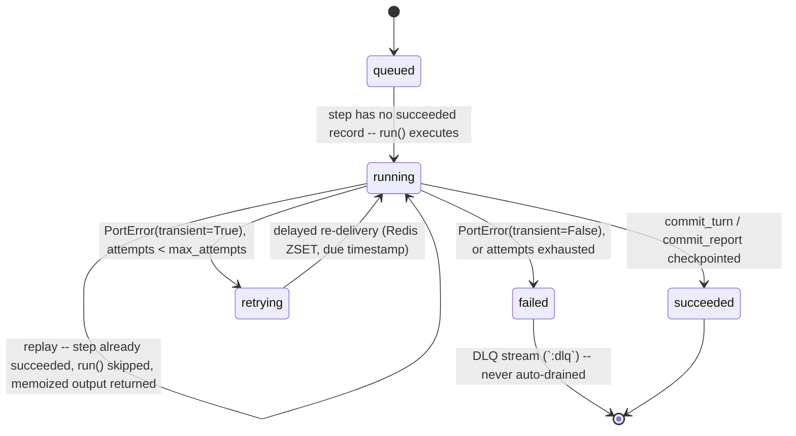
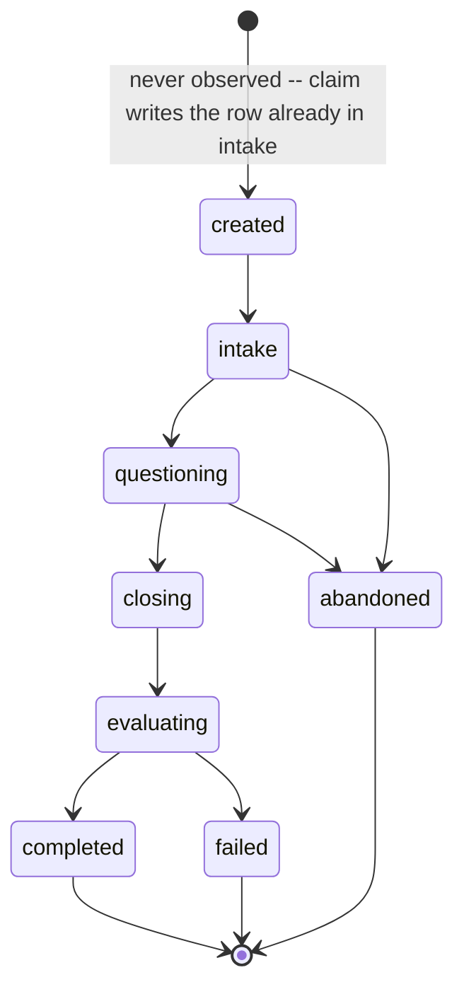

# Architecture

Long form of the shape in `README.md` §4. This is the section that explains
*why*, not only *what*.

## The rule

`packages/core` is pure: zero I/O, zero provider names, zero framework
imports. A unit test walks its AST and fails, naming the offending import, if
it finds anything outside the standard library, `pydantic` (including
`pydantic-settings`), or itself. `sqlmodel` is the import that test watches
hardest for — it looks like pydantic and the persistence adapter lives on it,
so a table class finding its way into the domain is exactly the mistake the
test exists to catch. See `docs/adr/0002-core-logging-without-structlog.md`
for the one place this rule shaped a choice a reader might not expect.

## Port catalogue

Every port is a `typing.Protocol` in `packages/core/src/interviewer_core/ports/`.
Every real adapter registers itself with the provider registry (`ProviderSpec`,
`packages/core/src/interviewer_core/registry/`) at import time; the fake or
in-memory column never registers — it is built directly in test fixtures, never
selected by an env var.

| Port | Method(s) | Real adapters (registered slug) | Test adapter |
|---|---|---|---|
| `LLMPort` | `complete` | `openrouter`, `openai_compat` | `FakeLLM` (`fake`) |
| `SpeechToTextPort` | `transcribe` | `openai_compat` | `FakeSTT` (`fake`) |
| `TextToSpeechPort` | `synthesize` | `openai_compat`, `none` (Null Object — text-only replies) | `FakeTTS` (test-only, not registered) |
| `BlobStore` | `put`, `get`, `signed_url` | `local_fs` | `InMemoryBlobStore` |
| `UserRepository`, `AreaRepository`, `PersonaRepository`, `InviteRepository`, `SessionRepository`, `TurnRepository`, `ArtifactRepository`, `ReportRepository`, `RunRepository` | CRUD, narrow — see `ports/repositories.py` | SQLModel / Postgres (`persistence/repositories.py`) | in-memory dicts (`persistence/in_memory.py`) |
| `WorkflowEngine` | `start`, `status`, `cancel` | `redis` (Redis Streams) | `inline` (both registered — `inline` is dev/test-grade, not a fake) |
| `Clock` | `now` | `SystemClock` | `FrozenClock` |
| `IdGenerator` | `new_id` | `Uuid7Ids` | `SeqIds` |

`Clock` and `IdGenerator` ship both implementations in the port module itself
(`ports/clock.py`, `ports/ids.py`) rather than behind an adapter package —
there is no credential and no transport to swap, so the adapter layer would
add a file with nothing to isolate.

## Pattern map

| Pattern | Where | Why |
|---|---|---|
| Ports & Adapters | ports live in `packages/core`, adapters in `packages/adapters` | swap infra without touching the engine |
| Registry + Factory | the registry module in `packages/core` | provider as data, no dispatch branch |
| Strategy | the question policy, the pipeline stages | interview behaviour swapped per persona, per request |
| Chain of Responsibility | the turn pipeline: `persist_audio → transcribe → compose → synthesize → commit_turn` | a stage that decides "no question needed" stops the chain before the expensive one |
| Decorator | retry / rate-limit / instrument wrapping `LLMPort` | cross-cutting concerns stay out of the adapter and out of the engine |
| Template Method | `WorkflowStep.execute()` = memo lookup → `run()` → checkpoint | determinism enforced once, for every step |
| Repository | the `*Repository` ports | the engine never sees a session row or a `SELECT` |
| Composition Root / DI | each app's own `deps.py` | one file builds the object graph; every other module receives it |
| Null Object | the `none` TTS adapter | a degraded dependency degrades the answer, it does not crash the turn |

## Workflow state machine

A run is `WorkflowRun.status` (`queued | running | succeeded | failed`); a step
inside it is `WorkflowStepRecord.status` (`pending | succeeded | failed`). The
turn workflow is `persist_audio → transcribe → compose → synthesize →
commit_turn` (`workflow/turn_steps.py`); the evaluation workflow, started by
**Finish**, is `collect_answers → score → commit_report`
(`workflow/evaluation_steps.py`). Both run through the same
`BaseStep.execute()` template (`workflow/base.py`): checkpoint lookup, then
`run()`, then checkpoint — so the diagram below is one workflow's shape, not
two.



The `running --> running` replay arrow is the one invariant the whole
adapter exists to prove: a worker `docker kill`ed mid-run and restarted
re-enters `running`, but `execute()` finds `commit_turn`'s predecessor steps
already `succeeded` and returns their stored output instead of paying for
`transcribe`/`compose`/`synthesize` again. `redis_streams.py` adds one more
layer above this that `inline.py` (single process, nothing to lease) does
not need: `XAUTOCLAIM` reclaims a pending entry whose consumer died before
acking, so a killed worker's run is picked up by another consumer rather
than stuck `running` forever.

## Session lifecycle



## Data model

Nine tables, all in `persistence/tables.py`. `PersonaQuestion` and
`QuestionScore` are not tables of their own — they live as JSONB
(`questions_json`, `scores_json`) inside the row that owns their lifecycle,
since neither is ever queried on its own field, only read or replaced whole
with the persona or the report (see
`docs/adr/0006-personas-versioned-never-edited.md` and
`docs/adr/0011-sqlmodel-tables-stay-in-persistence.md`).

```mermaid
erDiagram
    USER {
        string id PK
        string email UK
        string role
    }
    AREA {
        string id PK
        string slug UK
        string name
    }
    PERSONA {
        string id PK
        string area_id FK
        int version
        string status
        jsonb questions_json
    }
    INTERVIEW_INVITE {
        string id PK
        string slug UK
        string persona_id FK
        string passkey_hash
        int max_sessions
        int used_count
        string status
    }
    SESSION {
        string id PK
        string invite_id FK
        string persona_id FK
        string phase
        jsonb coverage_json
    }
    TURN {
        string id PK
        string session_id FK
        int index
        string kind
        string audio_artifact_id FK
    }
    ARTIFACT {
        string id PK
        string session_id FK
        string kind
        string uri
    }
    INTERVIEW_REPORT {
        string id PK
        string session_id FK UK
        jsonb scores_json
        float overall_score
    }
    WORKFLOW_RUN {
        string id PK
        string workflow
        string idempotency_key UK
        string status
    }
    WORKFLOW_STEP_RECORD {
        int id PK
        string run_id FK
        string name
        string status
    }

    AREA ||--o{ PERSONA : versions
    PERSONA ||--o{ INTERVIEW_INVITE : "generates links for"
    INTERVIEW_INVITE ||--o{ SESSION : claimed_into
    PERSONA ||--o{ SESSION : pins
    SESSION ||--o{ TURN : has
    SESSION ||--o{ ARTIFACT : has
    TURN }o--o| ARTIFACT : recording
    SESSION ||--o| INTERVIEW_REPORT : scored_into
    WORKFLOW_RUN ||--o{ WORKFLOW_STEP_RECORD : checkpoints
```

`Turn.index` and `WorkflowStepRecord.name` are each unique per parent
(`uq_turns_session_index`, `uq_step_records_run_name`) — the two constraints
that make a duplicate turn or a re-run step a schema violation, not a bug
someone has to notice.
