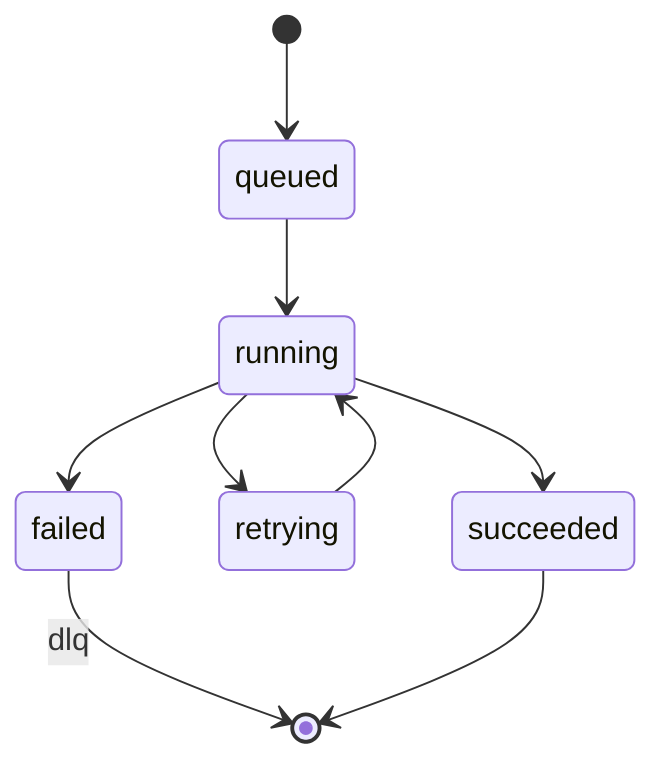
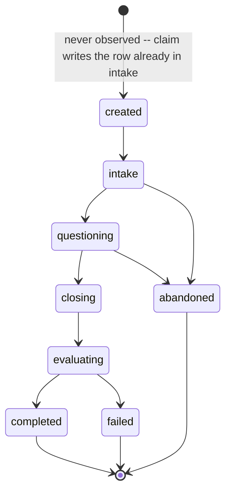
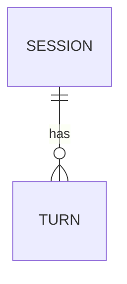

# Architecture

Long form of the shape in `README.md` §4. This is the section that explains
*why*, not only *what*.

## The rule

`packages/core` is pure: zero I/O, zero provider names, zero framework
imports. A unit test walks its AST and fails, naming the offending import, if
it finds anything outside the standard library, `pydantic` (including
`pydantic-settings`), or itself. `sqlmodel` is the import that test watches
hardest for — it looks like pydantic and the persistence adapter lives on it,
so a table class finding its way into the domain is exactly the mistake the
test exists to catch. See `docs/adr/0002-core-logging-without-structlog.md`
for the one place this rule shaped a choice a reader might not expect.

## Port catalogue

<!-- filled in T10 -->

| Port | Method(s) | Real adapters | Test adapter |
|---|---|---|---|
| (filled in T10) | | | |

## Pattern map

| Pattern | Where | Why |
|---|---|---|
| Ports & Adapters | ports live in `packages/core`, adapters in `packages/adapters` | swap infra without touching the engine |
| Registry + Factory | the registry module in `packages/core` | provider as data, no dispatch branch |
| Strategy | the question policy, the pipeline stages | interview behaviour swapped per persona, per request |
| Chain of Responsibility | the turn pipeline: `persist_audio → transcribe → compose → synthesize → commit_turn` | a stage that decides "no question needed" stops the chain before the expensive one |
| Decorator | retry / rate-limit / instrument wrapping `LLMPort` | cross-cutting concerns stay out of the adapter and out of the engine |
| Template Method | `WorkflowStep.execute()` = memo lookup → `run()` → checkpoint | determinism enforced once, for every step |
| Repository | the `*Repository` ports | the engine never sees a session row or a `SELECT` |
| Composition Root / DI | each app's own `deps.py` | one file builds the object graph; every other module receives it |
| Null Object | the `none` TTS adapter | a degraded dependency degrades the answer, it does not crash the turn |

## Workflow state machine

## Session lifecycle

## Data model

<!-- filled in T10 -->

