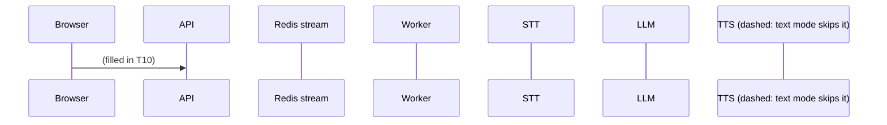
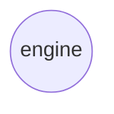

# the-interviewer

Adaptive Voice Interviewer — a hexagonal, modular-monolith service that
conducts spoken interviews against a versioned, area-scoped persona and
scores the transcript when the interview ends.

## 1. What it is

A candidate opens a public link, types a passkey, and is interviewed **by
voice** — record, listen back, re-record, send — while the interviewer
replies **in text**. One versioned persona per area declares the questions,
the coverage rules and the expected answer for each question; finishing the
interview scores the transcript against those expected answers. The
candidate never sees a score; the admin reads the transcript and the report.

## 2. Run it

```bash
cp .env.example .env && $EDITOR .env   # optional: one LLM key, one STT key
                                        # untouched, it runs on the `fake` slugs
make install && make up && make migrate && make seed
make dev                               # http://localhost:8000
# `make seed` printed an interview link and its passkey -- open that link
```

`make dev` starts both the API and the worker on the host, against
Postgres and Redis in Docker; `POST /session/turns` returns `202` and the
work happens on the worker, so a running interview needs both processes, not
just the API. With no provider account at all, `LLM_PROVIDER=fake` and
`STT_PROVIDER=fake` still conduct a whole scripted interview — the page says
which providers are fake in a banner. That banner is not the `degraded` flag,
which means one thing only: a guardrail fallback fired mid-interview.

## 3. The loop

<!-- filled in T10 -->



## 4. Architecture at a glance

<!-- filled in T10 -->



| Port | Real adapters | Test adapter |
|---|---|---|
| (filled in T10) | | |

## 5. Configuration

<!-- filled in T10 -->

| Variable | What it does | Default | Required |
|---|---|---|---|
| (filled in T10) | | | |

## 6. Swap an adapter

<!-- filled in T10 -->

## 7. Add a provider

<!-- filled in T10 -->

## 8. Testing

`make check` (`ruff`, `mypy --strict`, the unit suite, coverage ≥ 80%,
`docs-check`) runs with **no network and no containers**. That is a property
of the design, not a convenience: every external concern sits behind a port
with an in-memory or fake test double, so the whole engine, every route
handler and every workflow step can be exercised without Postgres, Redis or a
live provider. `make itest` runs the integration suite (`@pytest.mark.integration`)
against real Postgres and Redis; it is never part of `check` and never runs
unless asked for.

## 9. Deliberately not built

- **Video processing.** The browser turns the camera on for presence only —
  no frame leaves the page, no video is uploaded or stored.
- **A knowledge base, retrieval and embeddings.** The persona's question list
  and expected answers are the only grounding; no corpus, no passage
  retrieval, no embedder. See §10 below — this is the first expansion.
- **Spoken interviewer replies, in this build.** The port, the fake, the
  config block and the workflow step all exist; only the provider is absent.
  Turning it on is `REPLY_MODE=voice` plus a provider slug — no code change.
- **Translation.** Audio is transcribed, never translated. A session pins one
  language for both the STT hint and the interviewer's replies.
- **Typed answers.** The candidate answers by voice only; the control they
  get is the retake, not a textarea.
- **A score the candidate can see.** No result reaches the interviewee, in
  the UI or in any route their token can reach.
- **Real-time streaming.** No barge-in, no partial transcripts. The turn is
  record → send → answer.
- **Multi-tenant billing, org hierarchies, SSO.**
- **A Temporal deployment.** The workflow port is designed for it; a stub
  adapter documents the mapping. Implementing it is future work.

## 10. What comes next

The knowledge base and the embedder are the first thing built after this
plan, in two steps behind ports that do not exist yet:

1. **Knowledge base + lexical retrieval** — a `KnowledgeRetriever` port, its
   own migration, deterministic chunking, and a `retrieve` step inserted
   between `transcribe` and `compose` that degrades to empty and records that
   it did.
2. **The embedder** — embeddings and a vector adapter behind the same port,
   selected by `RETRIEVAL_PROVIDER=vector`, with no engine change.

Everything else scoped as an expansion — a real S3/GCS drill, the Temporal
adapter, SSE progress, per-run cost accounting — attaches the same way: a new
adapter behind a port this build already has.
