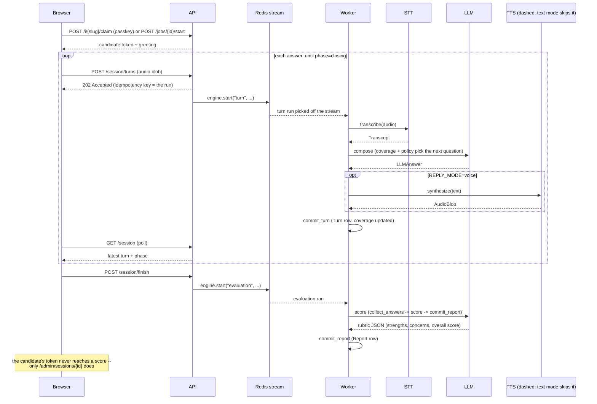

# the-interviewer

Adaptive Voice Interviewer — a hexagonal, modular-monolith service that
conducts spoken interviews against a versioned, area-scoped persona and
scores the transcript when the interview ends.

## 1. What it is

A candidate opens a public link, types a passkey, and is interviewed **by
voice** — record, listen back, re-record, send — while the interviewer
replies **in text**. One versioned persona per area declares the questions,
the coverage rules and the expected answer for each question; finishing the
interview scores the transcript against those expected answers. The
candidate never sees a score; the admin reads the transcript and the report.

## 2. Run it

```bash
cp .env.example .env && $EDITOR .env   # optional: one LLM key, one STT key
                                        # untouched, it runs on the `fake` slugs
make install && make up && make migrate && make seed
make dev                               # http://localhost:8000
# `make seed` printed an interview link and its passkey -- open that link
```

`make dev` starts both the API and the worker on the host, against
Postgres and Redis in Docker; `POST /session/turns` returns `202` and the
work happens on the worker, so a running interview needs both processes, not
just the API. With no provider account at all, `LLM_PROVIDER=fake` and
`STT_PROVIDER=fake` still conduct a whole scripted interview — the page says
which providers are fake in a banner. That banner is not the `degraded` flag,
which means one thing only: a guardrail fallback fired mid-interview.

## 3. The loop

Two entry points reach the same session, then everything after is identical:
an admin issues an `/i/{slug}` invite + passkey, or the candidate lands on
`jobs.html`, picks a role and `POST /jobs/{area_id}/start` mints and claims a
single-use invite server-side — either way the browser walks out with the
same candidate bearer token.



`POST /session/turns` and `/finish` both answer `202` and return immediately;
the workflow run happens on the worker, off the request. `_start_run`
(`apps/api/src/interviewer_api/routers/session.py`) makes this idempotent —
a retried `202` with the same idempotency key joins the existing run instead
of starting a second one.

## 4. Architecture at a glance

Hexagonal: the engine and the routes both depend on **ports** (protocols in
`packages/core`), never on a concrete adapter. `apps/api` and `apps/worker`
share one composition root shape (each has its own `deps.py`) that reads
`Settings`, asks the registry for the configured provider, and wires the
result behind the port — nothing downstream of a port knows which adapter it
got.

```mermaid
flowchart LR
    subgraph Browser
        jobs[jobs.html]
        interview[interview.html]
        admin[admin.html]
    end

    subgraph api[apps/api]
        routers["routers: auth · jobs · session · admin"]
    end

    subgraph worker[apps/worker]
        pipeline["TurnPipeline: policies · coverage · evaluator"]
    end

    subgraph ports[packages/core/ports]
        direction TB
        P1[LLMPort]
        P2[SpeechToTextPort / TextToSpeechPort]
        P3[BlobStore]
        P4[WorkflowEngine]
        P5[Repositories]
    end

    subgraph adapters[packages/adapters]
        direction TB
        A1["OpenRouter / OpenAI-compat / Fake"]
        A2["OpenAI-compat / Fake / None"]
        A3["LocalFS / InMemory"]
        A4["Redis Streams / Inline"]
        A5["Sql* / InMemory (Postgres)"]
    end

    jobs --> routers
    interview --> routers
    admin --> routers
    routers -->|"start(\"turn\"|\"evaluation\")"| P4
    worker --> pipeline --> P1 & P2 & P5
    routers --> P5
    P1 --> A1
    P2 --> A2
    P3 --> A3
    P4 --> A4
    P5 --> A5
    A5 --> PG[(Postgres)]
    A4 --> R[(Redis)]
```

| Port | Real adapters | Test adapter |
|---|---|---|
| `LLMPort` | `OpenRouterLLM`, `OpenAICompatLLM` — wrapped `InstrumentedLLM(RateLimitedLLM(RetryingLLM(raw)))` | `FakeLLM` (scripted, registered as `llm=fake`) |
| `SpeechToTextPort` | `OpenAICompatSTT` | `FakeSTT` (`stt=fake`) |
| `TextToSpeechPort` | `OpenAICompatTTS` | `NoneTTS` (`tts=none`, real no-op), `FakeTTS` (unit tests only, not registry-selectable) |
| `BlobStore` | `LocalFsBlobStore` (`storage=local_fs`) — S3/GCS credential shapes exist in `Settings` but have no adapter yet | `InMemoryBlobStore` |
| `WorkflowEngine` | `RedisStreamsWorkflowEngine` (`workflow=redis`) — consumer group + lease + DLQ, see `packages/adapters/src/interviewer_adapters/workflow/CONTEXT.md` | `InlineWorkflowEngine` (`workflow=inline`, runs the steps in-process — also the "dev/test, no worker needed" path) |
| `UserRepository` … `RunRepository` (9 total, `ports/repositories.py`) | `Sql*Repository` over SQLAlchemy async / Postgres | `InMemory*Repository` (`packages/adapters/src/interviewer_adapters/persistence/in_memory.py`) |

Every real adapter registers itself as a `(kind, name)` pair in
`interviewer_core.registry` at import time — §6 and §7 below.

## 5. Configuration

Everything below is a field on `interviewer_core.config.Settings`
(`pydantic-settings`, `.env`-backed, `__`-nested for provider creds — e.g.
`LLM__OPENROUTER__API_KEY`). No module reads `os.environ` directly; that's
an enforced invariant, not a convention. A missing/invalid **required**
field fails fast at boot as a `ConfigError` naming it, never mid-interview.

**Core**

| Variable | What it does | Default | Required |
|---|---|---|---|
| `APP_ENV` | environment label, log context only | `dev` | no |
| `LOG_LEVEL` | Python log level | `INFO` | no |
| `LOG_JSON` | structured (JSON) vs. plain log lines | `true` | no |
| `DATABASE_URL` | Postgres DSN, `postgresql+asyncpg://...` | — | **yes** |
| `REDIS_URL` | Redis DSN — workflow queue + streams | — | **yes** |

**Auth**

| Variable | What it does | Default | Required |
|---|---|---|---|
| `AUTH_SECRET_KEY` | HMAC key signing every bearer token, admin and candidate | `""` | boots blank, but every token is forgeable until set — treat as required outside local dev |
| `ACCESS_TOKEN_TTL_MINUTES` | admin session token TTL | `60` | no |
| `REGISTRATION_OPEN` | allow `POST /register` to mint a new admin | `false` | no |
| `PUBLIC_BASE_URL` | base URL invite links are built from | `http://localhost:8000` | no |
| `INVITE_TTL_HOURS` | admin-issued `/i/{slug}` invite lifetime | `168` | no |
| `CANDIDATE_TOKEN_TTL_MINUTES` | candidate token TTL, both entry points | `120` | no |
| `PASSKEY_MAX_ATTEMPTS` | wrong-passkey attempts before lockout | `5` | no |
| `PASSKEY_LOCKOUT_MINUTES` | lockout duration once tripped | `15` | no |

**Seed** (`scripts/seed.py` only — never read by the API or the worker)

| Variable | What it does | Default | Required |
|---|---|---|---|
| `SEED_ADMIN_EMAIL` | the admin account `make seed` creates | `admin@example.com` | no |
| `SEED_ADMIN_PASSWORD` | its password, printed once and not stored | `changeme123!` | no |

**LLM**

| Variable | What it does | Default | Required |
|---|---|---|---|
| `LLM_PROVIDER` | registry slug: `fake`, `openrouter`, `openai_compat` | `fake` | no |
| `LLM_MODEL` | model id sent to the provider | `openai/gpt-4.1-mini` | no |
| `LLM_TEMPERATURE` | sampling temperature | `0.4` | no |
| `LLM_MAX_TOKENS` | completion cap | `800` | no |
| `LLM_TIMEOUT_SECONDS` | HTTP timeout | `60` | no |
| `LLM__OPENROUTER__API_KEY` | — | — | only if `LLM_PROVIDER=openrouter` |
| `LLM__OPENROUTER__BASE_URL` | override | `https://openrouter.ai/api/v1` | no |
| `LLM__OPENAI_COMPAT__API_KEY` / `LLM__OPENAI_COMPAT__BASE_URL` | — | — | only if `LLM_PROVIDER=openai_compat` |

**Speech**

| Variable | What it does | Default | Required |
|---|---|---|---|
| `STT_PROVIDER` | registry slug: `fake`, `openai_compat` | `fake` | no |
| `STT_MODEL` / `STT_LANGUAGE` | model id / transcription language hint | `""` | no |
| `STT__OPENAI_COMPAT__API_KEY` / `STT__OPENAI_COMPAT__BASE_URL` | — | — | only if `STT_PROVIDER=openai_compat` |
| `REPLY_MODE` | interviewer replies in `text` or `voice` | `text` | no |
| `TTS_PROVIDER` | registry slug: `none`, `openai_compat` | `none` | `REPLY_MODE=voice` + `TTS_PROVIDER=none` fails at boot — never silently answers in text |
| `TTS_MODEL` / `TTS_VOICE` | model id / voice id | `""` | no |
| `TTS__OPENAI_COMPAT__API_KEY` / `TTS__OPENAI_COMPAT__BASE_URL` | — | — | only if `TTS_PROVIDER=openai_compat` |

**Infrastructure adapters**

| Variable | What it does | Default | Required |
|---|---|---|---|
| `STORAGE_PROVIDER` | registry slug — only `local_fs` has an adapter today | `local_fs` | no |
| `STORAGE__LOCAL_FS__ROOT` | directory audio + artifacts land in | `./var/blobs` | no |
| `STORAGE__GCS__BUCKET` / `STORAGE__GCS__CREDENTIALS_JSON` | GCS credential shape reserved on `Settings`; no adapter registered yet — see §10 | — | not usable yet |
| `STORAGE__S3__BUCKET` / `STORAGE__S3__REGION` / `STORAGE__S3__ACCESS_KEY_ID` / `STORAGE__S3__SECRET_ACCESS_KEY` / `STORAGE__S3__ENDPOINT_URL` | S3 credential shape, same story | — | not usable yet |
| `WORKFLOW_PROVIDER` | registry slug: `inline`, `redis` | `redis` | no |
| `WORKFLOW_VISIBILITY_TIMEOUT_SECONDS` | Redis Streams lease before a stuck message is reclaimed | `120` | no |
| `WORKFLOW_MAX_ATTEMPTS` | attempts before a step is a permanent failure | `3` | no |

**Upload guards** — validated at the boundary, nowhere else

| Variable | What it does | Default | Required |
|---|---|---|---|
| `UPLOAD_MAX_BYTES` | rejects a larger recording | `26214400` (25 MiB) | no |
| `UPLOAD_MAX_SECONDS` | rejects a longer recording | `300` | no |
| `UPLOAD_ALLOWED_MIME` | comma-separated allowlist | `audio/webm,audio/ogg,audio/wav,audio/mpeg` | no |
| `SESSION_MAX_TURNS` | hard cap; hitting it forces `phase=closing` | `40` | no |

## 6. Swap an adapter

Env var only, no code change, no redeploy of different code — the same
image just reads different config:

```bash
LLM_PROVIDER=openrouter
LLM__OPENROUTER__API_KEY=sk-...
```

`deps.get_llm()` calls `require_spec("llm", settings.llm_provider)`, gets
back the registered `ProviderSpec`, and calls its `build(settings)`. Ask for
a slug nobody registered (`LLM_PROVIDER=anthropic` today) and it's a
`ConfigError` naming the slug and listing what *is* registered — at
`deps.warm_up()` on boot, not on the first request.

## 7. Add a provider

One new module under the adapter's kind, self-registering at import time —
never a branch added to a factory.
`packages/adapters/src/interviewer_adapters/llm/openrouter.py` is the
template:

```python
# packages/adapters/src/interviewer_adapters/llm/my_provider.py
from interviewer_core.config import Settings
from interviewer_core.errors import ConfigError
from interviewer_core.ports.llm import LLMPort
from interviewer_core.registry import ProviderSpec, register


class MyProviderLLM: ...  # implements LLMPort.complete() -- structural, no base class needed


def _build(settings: Settings) -> LLMPort:
    if not settings.llm.my_provider.api_key:
        raise ConfigError("missing LLM__MY_PROVIDER__API_KEY")
    return MyProviderLLM(api_key=settings.llm.my_provider.api_key, model=settings.llm_model)


register(ProviderSpec(kind="llm", name="my_provider", build=_build, label="My Provider"))
```

Then:

1. If it takes new credentials, add a `ProviderCreds` field to the matching
   `*Creds` model in `interviewer_core/config.py` (e.g. `LLMCreds`) —
   `__`-nesting picks up `LLM__MY_PROVIDER__API_KEY` automatically.
2. Append one import line to the kind's `__init__.py`
   (`interviewer_adapters/llm/__init__.py`) so importing the package
   registers the provider.
3. `LLM_PROVIDER=my_provider` selects it — nothing else in `apps/api` or
   `apps/worker` changes; both read the port, never the adapter.

Same shape for `stt`/`tts` (`ports/speech.py`), `storage`
(`ports/storage.py`) and `workflow` (`ports/workflow.py`) — swap the port
and the kind string, everything else in this recipe holds.

## 8. Testing

`make check` (`ruff`, `mypy --strict`, the unit suite, coverage ≥ 80%,
`docs-check`) runs with **no network and no containers**. That is a property
of the design, not a convenience: every external concern sits behind a port
with an in-memory or fake test double, so the whole engine, every route
handler and every workflow step can be exercised without Postgres, Redis or a
live provider. `make itest` runs the integration suite (`@pytest.mark.integration`)
against real Postgres and Redis; it is never part of `check` and never runs
unless asked for.

## 9. Deliberately not built

- **Video processing.** The browser turns the camera on for presence only —
  no frame leaves the page, no video is uploaded or stored.
- **A knowledge base, retrieval and embeddings.** The persona's question list
  and expected answers are the only grounding; no corpus, no passage
  retrieval, no embedder. See §10 below — this is the first expansion.
- **Spoken interviewer replies, in this build.** The port, the fake, the
  config block and the workflow step all exist; only the provider is absent.
  Turning it on is `REPLY_MODE=voice` plus a provider slug — no code change.
- **Translation.** Audio is transcribed, never translated. A session pins one
  language for both the STT hint and the interviewer's replies.
- **Typed answers.** The candidate answers by voice only; the control they
  get is the retake, not a textarea.
- **A score the candidate can see.** No result reaches the interviewee, in
  the UI or in any route their token can reach.
- **Real-time streaming.** No barge-in, no partial transcripts. The turn is
  record → send → answer.
- **Multi-tenant billing, org hierarchies, SSO.**
- **A Temporal deployment.** The workflow port is designed for it; a stub
  adapter documents the mapping. Implementing it is future work.

## 10. What comes next

The knowledge base and the embedder are the first thing built after this
plan, in two steps behind ports that do not exist yet:

1. **Knowledge base + lexical retrieval** — a `KnowledgeRetriever` port, its
   own migration, deterministic chunking, and a `retrieve` step inserted
   between `transcribe` and `compose` that degrades to empty and records that
   it did.
2. **The embedder** — embeddings and a vector adapter behind the same port,
   selected by `RETRIEVAL_PROVIDER=vector`, with no engine change.

Everything else scoped as an expansion — a real S3/GCS drill, the Temporal
adapter, SSE progress, per-run cost accounting — attaches the same way: a new
adapter behind a port this build already has.

## 11. API endpoints

Every JSON response uses the same envelope (`success`, `data`, `error`,
`metadata`) from `interviewer_api.envelope`. Three auth tiers: **public** (no
token), **candidate** (`Authorization: Bearer <candidate token>`, checked by
`deps.require_candidate_session`), **admin** (`Authorization: Bearer <admin
token>`, checked by `deps.require_admin`) — see §5's Auth block for how a
token is minted.

**Health**

| Method & path | Auth | What it does |
|---|---|---|
| `GET /healthz` | public | liveness only, no dependency check |
| `GET /readyz` | public | pings Postgres and, if `WORKFLOW_PROVIDER=redis`, Redis too; `503` if either is down |

**Public — browsing and admin auth**

| Method & path | Auth | What it does |
|---|---|---|
| `GET /jobs` | public | lists published jobs (area + latest persona) for `jobs.html` |
| `POST /jobs/{area_id}/start` | public | self-claims a single-use, 1-hour invite server-side and returns a candidate token — no passkey step |
| `POST /auth/register` | public | creates an admin account; `403` unless `REGISTRATION_OPEN=true` |
| `POST /auth/login` | public | email + password → admin bearer token |

**Candidate — the shared link and the turn loop**

| Method & path | Auth | What it does |
|---|---|---|
| `GET /i/{slug}` | public | `interview.html` to a browser (`Accept: text/html`), a no-credential invite preview to the page's own `fetch()` |
| `POST /i/{slug}/claim` | public | passkey → candidate token (admin-issued entry point; same token shape as `/jobs/{area_id}/start`) |
| `GET /session` | candidate | current phase, question, and turn history for the caller's own session |
| `POST /session/turns` | candidate | uploads one answer's audio; `202` and starts the `"turn"` workflow (§3) |
| `POST /session/finish` | candidate | `202` and starts the `"evaluation"` workflow; only valid once `phase` is `closing`/`evaluating`/`completed` |
| `GET /session/runs/{run_id}` | candidate | polls a workflow run — an `"evaluation"` run never leaks a score, only `status` |
| `GET /session/artifacts/{artifact_id}` | candidate | streams one audio artifact, scoped to the caller's own session |

**Admin — areas, personas, invites, review**

| Method & path | Auth | What it does |
|---|---|---|
| `POST /areas` | admin | creates an interview area |
| `POST /areas/{area_id}/personas` | admin | publishes a new persona version for an area |
| `POST /invites` | admin | mints an `/i/{slug}` invite + one-time passkey — returned once here, never again |
| `DELETE /invites/{invite_id}` | admin | retires an invite; sessions already claimed under it are untouched |
| `GET /admin/sessions` | admin | every session, newest first, with area/persona/phase/overall score |
| `GET /admin/sessions/{session_id}` | admin | one session's full transcript and report (scores, verdicts, rationale) — the only route that ever serves a score |
| `GET /admin/artifacts/{artifact_id}` | admin | streams any audio artifact, not scoped to one candidate's session |

**Static**

`apps/web/` (`jobs.html`, `interview.html`, `admin.html`) is served by a
`StaticFiles` mount at `/`, registered last in
`apps/api/src/interviewer_api/main.py` so it never shadows a route above it.
