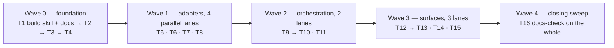

# PRD — Adaptive Voice Interviewer

> An AI interviewer that listens. A candidate opens a **public link**, types a
> **passkey**, and is greeted, asked their name, walked through the persona's
> numbered questions — recording each answer, re-recording it until they are
> happy with it — and sent off with a closing line. A worker transcribes every
> answer, writes the next question, and at the end **scores the whole interview**
> against the answers the persona expected. The candidate never sees a score and
> never creates an account; the **admin** reads the transcript and the report.
> **Audio in, text out** in the PoC; speaking back is one flag
> (`REPLY_MODE=voice`) over a port that ships from day one. Every external
> concern — LLM, speech, storage, persistence, and the durable workflow that
> runs a turn — sits behind a port with at least two adapters.
>
> Status: ready to build. §11 is the task list, grouped into waves that run in
> parallel worktrees.

---

## 1. Context

We need a production-ready service that conducts **spoken interviews**. A
candidate (or research subject) talks to an AI interviewer: they record an
answer, send it, and get the next question back.

### The session, end to end

This order is the product. It is a **state machine on the session**, not a
convention the front-end happens to follow (§4):

| # | Step | What happens | Model call? |
|---|---|---|---|
| 1 | **claim** | The candidate opens the public link and enters the passkey. No account, no email, no password. A session is created and a short-lived, **session-scoped** token is issued | no |
| 2 | **greeting** | The interviewer introduces itself in the persona's own authored words, and asks for the candidate's name | no — authored text, so the first screen is instant and free |
| 3 | **intake** | The candidate records their name. It is transcribed, the name is extracted and **registered on the session**; this turn is never scored | STT + one cheap call |
| 4 | **questioning** | The persona's questions, **numbered and visible** (`3 of 8`). For each: record, listen back, re-record if it was bad, then send. Only what is sent is stored | STT + LLM per turn |
| 5 | **closing** | The completion rule fires (`min_coverage` reached, or `max_questions`); the interviewer says goodbye in the persona's authored farewell. Recording is over | no |
| 6 | **evaluating** | The transcript goes to the evaluator: every question scored against the answer the persona expected, with a rationale | one LLM call |
| 7 | **completed** | Session, audio, transcript and report are stored **for the admin**. The candidate is told it was sent for review, and is shown no score |  |

Steps 3–7 are the values of `Session.phase`. Steps 1 and 2 are not phases and
never were: the claim **creates the session already in `intake`**, in the same
transaction that spends the invite, and the greeting is authored text handed back
with the token. Nothing is persisted in a `created` phase that a client could
observe — `created` exists only as the dataclass's initial value, before the row
is written (§4).

Two consequences worth stating up front. **The candidate is not a user** —
there is no registration, no login and no listing; a passkey buys one session
and nothing else. And **the candidate is never shown their result** — the score
exists for the admin, so a report that flatters or accuses is read by someone
accountable before it is read by the person it is about.

**The PoC is audio-in, text-out.** The candidate answers by voice — record,
listen back, re-record, send — and the interviewer replies **in writing**. Spoken replies are a
`TextToSpeechPort` that exists from the first wave and stays switched off
(`REPLY_MODE=text`, `TTS_PROVIDER=none`); turning voice on is a flag and a
provider slug, never a refactor. The workflow keeps the step that would produce
the audio, and that step records itself skipped (§5.4).

**Nothing is computed inside the HTTP request.** `POST /session/turns`
stores the upload, enqueues a run and returns `202`. Transcription, composition
and evaluation all happen in a **worker draining a Redis stream** — the API is a
producer, never an executor.

**The persona is the whole configuration.** One versioned object, scoped to an
**area** (backend, data, product, clinical research, whatever), carries:

1. **who is asking** — tone, seniority, language, model settings;
2. **how it opens and closes** — the authored greeting, the way it asks for the
   candidate's name, and the farewell;
3. **what it asks** — the numbered question list, grouped by topic, with the
   coverage rules (how many questions, how deep to follow up, when the interview
   ends);
4. **what a good answer looks like** — the expected answer per question, which
   is what the **evaluator** scores the transcript against when the session
   finishes.

There is no second configuration entity and no corpus to ingest: adding an
interview domain is publishing a persona version. Grounding questions in an
area-scoped knowledge base is a real feature and an explicit **expansion**
(§11 `E1`), not part of this scope — the persona already says what to ask.

The engineering point of the project is not the prompt. It is that **every
external concern sits behind a port**: LLM, speech-to-text, text-to-speech,
blob storage, session persistence, and — the one that usually gets
hardcoded — **the durable workflow that runs a turn**. Today the workflow runs
on Redis; in production it would run on Temporal. That swap must cost one
adapter and zero engine changes, and the PRD is written so that it does.

The task list (§11) is ordered so that **P0 alone is a complete, demoable,
tested product**; everything else is an **expansion**, and every expansion is a
new adapter behind a port that already exists — including the knowledge base.

---

## 2. Goals / Non-goals

### Goals

- **Audio-in / text-out** interview loop, with session state persisted and
  resumable. Voice-out is the same loop under `REPLY_MODE=voice` with a TTS
  provider configured — no engine change, no new step.
- **Every turn is executed by a worker off a Redis stream.** The API enqueues
  and polls; it never transcribes or composes in the request. A turn is paid
  external calls and a write — work that must survive a deploy, not work to hold
  a connection open for.
- Configuration-driven behaviour: **one versioned persona per area** carries the
  questions, the coverage rules and the expected answers. Adding an interview
  domain is publishing a persona, never a code change.
- **An evaluated interview, not only a conducted one.** Finishing a session
  scores each answer against the expected answer the persona declared, with a
  rationale, and stores the report under the persona version that produced it —
  **for the admin**, who is the only reader of a score.
- **A candidate with no account.** One public link plus a passkey opens exactly
  one interview. The token it buys is scoped to that session and expires; it
  cannot list, cannot read another session, cannot read a report.
- **The interview has a shape and the server owns it**: greeting → name →
  numbered questions → farewell → evaluation. The phase lives on the session, so
  a reloaded page, a second tab or a hand-rolled client cannot skip the intake or
  answer a question the persona never reached.
- **Recording is the candidate's to control**: start, stop, listen back,
  re-record. Only the take they send is uploaded, and only sent takes are stored.
- Hexagonal modular monolith. Domain and engine are pure: **zero I/O, zero
  provider names, zero framework imports**.
- Adapters selected by configuration through a registry; adding a provider is a
  new file, never an edit to a dispatch `if/elif`.
- Turn execution is a **durable workflow**: retriable, idempotent, and
  deterministic on restart — already-completed steps are skipped, never re-paid.
- Auth in two shapes, both enforced by dependencies rather than by convention:
  an admin JWT over hashed passwords, and a session-scoped candidate token bought
  with a bcrypt-hashed, rate-limited passkey.
- Heavy unit-test coverage (≥80%), all of it running without network, without
  Postgres and without Redis, on in-memory adapters.
- Documentation that a reviewer and an LLM can both navigate: README with
  Mermaid diagrams, a `CONTEXT.md` per module, ADRs, and a `build` skill whose
  last step is updating them (§14) — checked by `make docs-check`, not by
  goodwill.

### Non-goals (documented, deliberately out of scope)

- Video processing. The browser turns the camera **on** for presence only; no
  frame leaves the page, no video is uploaded or stored.
- **A knowledge base, retrieval and embeddings.** No corpus is ingested, no
  passage is retrieved, no embedder runs. The persona's question list and
  expected answers are the only grounding the PoC has, which is enough to run a
  complete interview and to score it. Adding retrieval later is an adapter
  behind a port that does not exist yet and a step the workflow does not have —
  scoped as expansion `E1` (§11), deliberately, so the loop is finished first.
- **Spoken interviewer replies, in the PoC.** The port, the fake, the config
  block and the workflow step are all built; only the provider is absent, and
  the step records itself skipped instead of branching around it. First
  voice-out is `REPLY_MODE=voice` plus a slug in `.env` — that is the whole
  change, and §12.5 verifies it.
- **Translation.** Audio is transcribed, never translated. The session pins one
  `language`; it is passed to STT as a hint and the interviewer answers in it.
  An interview whose questions and answers are in different languages is out of
  scope — it is a different product decision, not a missing adapter.
- **Typed answers.** The candidate answers **by voice only**; the control they
  get is the retake, not a textarea. A typed path would mean a turn with no
  artifact and a skipped `transcribe`, and the product is an interview that is
  listened to. Kept as expansion `E5`, deliberately not built.
- **A score the candidate can see.** No result is returned to the interviewee,
  in the UI or in any route their token reaches. Sharing it is a decision a human
  makes outside this system.
- Real-time streaming (barge-in, partial transcripts). The turn is
  record → send → answer.
- Multi-tenant billing, org hierarchies, SSO.
- A Temporal deployment. The **port** is designed for it and a stub adapter
  documents the mapping; implementing it is future work.

---

## 3. Architecture

### 3.1 Shape

A **modular monolith** in a `uv` workspace. One repository, one domain core,
two entrypoints that share it.

```
packages/core/            # pure: domain + ports + engine. No I/O. No httpx. No FastAPI.
  src/interviewer_core/
    domain/               # Session (+ phase machine), Turn, Area, Persona, Invite,
                          # Coverage, Artifact, Report
    ports/                # Protocols: llm, stt, tts, storage, repos,
                          #            workflow, clock, ids
    engine/               # interview turn pipeline, phase rules, question policy,
                          # guardrails, evaluator (scores against the persona)
    registry/             # provider registry (spec + register + require_spec)

packages/adapters/        # everything that touches the world
  src/interviewer_adapters/
    llm/                  # openrouter.py, openai_compat.py, fake.py
    speech/               # stt_openai_compat.py, tts_openai_compat.py, tts_none.py, fake.py
    storage/              # local_fs.py, gcs.py, s3.py, in_memory.py
    persistence/          # SQLModel tables + repos, in_memory repos
    workflow/             # redis_streams.py, inline.py, temporal.py (stub, expansion)

apps/api/                 # FastAPI: routers, schemas, auth, composition root (deps.py)
apps/worker/              # workflow consumer process (same core, same adapters)
apps/web/                 # two static pages served by the API (no build step):
                          #   interview.html — public, passkey, the candidate's loop
                          #   admin.html     — login, sessions list, transcript + report

docs/adr/                 # one short ADR per decision that will be questioned
.claude/skills/build/     # the build procedure, whose last step is documentation (§14.3)
scripts/                  # demo.py, docs_check.py
```

Every package and app directory carries a `CONTEXT.md` (§14.2). It is enforced
by `make docs-check`, so a new module without one fails the build.

**Boundary enforcement is a test, not a convention**: a unit test walks the AST
of `packages/core` and fails if it imports anything outside the standard
library, `pydantic`, or itself. A boundary nobody checks is a boundary that
lasts until the first deadline.

### 3.2 Ports (the whole contract surface)

Every port is a `typing.Protocol` in `core/ports`. Each has at least two
implementations: one real, one fake used by tests.

| Port | Method(s) | Real adapters | Test adapter |
|---|---|---|---|
| `LLMPort` | `complete(messages, tools?) -> LLMAnswer` | `openrouter`, `openai_compat`, `fake` (dev only, refused in prod) | scripted `FakeLLM` |
| `SpeechToTextPort` | `transcribe(audio, mime, language?) -> Transcript` | `openai_compat` (whisper-shaped), `fake` (dev only) | `FakeSTT` |
| `TextToSpeechPort` | `synthesize(text, voice, format) -> AudioBlob` | `openai_compat`, `none` (Null Object — PoC default) | `FakeTTS` (silent wav) |
| `BlobStore` | `put/get/signed_url` | `local_fs`, `gcs`, `s3` | `InMemoryBlobStore` |
| `SessionRepository`, `TurnRepository`, `AreaRepository`, `PersonaRepository`, `InviteRepository`, `ArtifactRepository`, `UserRepository`, `RunRepository`, `ReportRepository` | CRUD, narrow | SQLModel async / Postgres | in-memory dicts |
| `WorkflowEngine` | `start`, `status`, `cancel` | `redis_streams` | `inline` |
| `Clock` | `now()` | `SystemClock` | `FrozenClock` |
| `IdGenerator` | `new_id()` | uuid7 | `SeqIds` |

`BlobStore` ships with **three real adapters** — a local directory, GCS and S3 —
because audio is the one thing this product must keep and the place it is kept
is the first thing an operator wants to change. They are all the same three
methods — `put`, `get`, `signed_url` — and `signed_url` is native on the two
cloud stores and a short-lived token the API validates on `local_fs`. Nothing
above the port learns which one is configured, and §12.5 flips between them as a
drill.

**There is no retrieval port**, on purpose. A port with no adapter and no caller
is speculative design: it fixes a signature before anything has used it. When
expansion `E1` adds a knowledge base, the port arrives with its lexical adapter,
its fake and the workflow step that calls it — in one change, shaped by what the
engine actually needs by then.

The repository ports are implemented with **SQLModel** on top of SQLAlchemy 2.x
async and `asyncpg`. SQLModel is a *pydantic*-flavoured declarative layer: one
class carries the column definitions and the field types, `select()` is typed,
and the models read like the domain does. That is exactly the reason to state
the boundary loudly rather than quietly enjoy it: **a SQLModel table class is
not a domain object.** It lives in `packages/adapters/.../persistence/tables.py`,
it never crosses the port, and the repository converts it into the frozen
dataclasses of §4 before returning. The temptation SQLModel creates — pass the
table straight up, it validates anyway — trades the whole boundary for a few
saved lines: the core would import SQLAlchemy, the purity test would fail, and
`session.commit()` would decide when a domain object is valid. The engine sees
dataclasses; the database sees tables; the repository is the only translator.

Two rules that keep these honest:

- **No port retries, rate-limits or prices anything.** Those are decorators
  (§3.4) wrapped around the port, so the machinery built to observe them can
  actually see them.
- **No port raises a provider-specific exception.** Each adapter maps its
  transport failure onto `PortError(transient: bool, status: int | None)`. The
  workflow decides to retry from `transient`, never from an HTTP status it had
  to guess at.

### 3.3 Provider registry (how adapters get chosen)

Provider dispatch is a **value**, not a branch. Copying a provider name into an
`if/elif` spreads the knowledge of each integration across the codebase, and a
misspelled slug in configuration falls silently into whichever branch sits at
the bottom.

```python
@dataclass(frozen=True)
class ProviderSpec:
    kind: str                      # "llm" | "stt" | "tts" | "storage" | ...
    name: str                      # "openrouter" | "openai_compat" | ...
    build: Callable[[ModelConfig, ProviderCreds], Any]
    rate_per_minute: int = 60
    label: str = ""

register(spec)          # refuses a name that already has an owner
require_spec(kind, name)  # -> ProviderSpec, or ConfigError naming the unknown slug
known_providers(kind)   # -> the list the UI/CLI offers
```

Adapters self-declare in their own module; `interviewer_adapters/__init__.py`
imports them so any import of the package leaves them registered. Nobody has to
remember to call anything. Adding a provider = one new file + one import line.

Credentials follow the same shape for every provider — no per-provider fields on
a frozen dataclass:

```python
@dataclass(frozen=True)
class ProviderCreds:
    api_key: str | None = None
    base_url: str | None = None
    extra: Mapping[str, Any] = field(default_factory=dict)   # only that adapter reads it
```

An adapter missing its key raises `ConfigError` **naming the exact environment
variable that is missing** — the adapter knows the name, the factory does not.

### 3.4 Design patterns, mapped

| Pattern | Where | Why |
|---|---|---|
| Ports & Adapters | everything above | swap infra without touching the engine |
| Registry + Factory | `core/registry`, `build_llm/build_stt/build_tts` | provider as data, no dispatch branch |
| Strategy | `QuestionPolicy` (`guided`, `adaptive`, `stress`), `TurnPipeline` stages | interview behaviour swapped per persona, per request |
| Chain of Responsibility | `TurnPipeline`: `route → compose → guard`; each stage may end the turn with a reason | a stage that decides "no question needed" stops the chain, cheaply, before the expensive one |
| Decorator | `RetryingLLM`, `RateLimitedLLM`, `InstrumentedLLM` wrapping `LLMPort` | cross-cutting concerns stay out of adapters and out of the engine |
| State | `Session.phase`: `intake → questioning → closing → evaluating → completed`, with the legal transitions in the domain | the interview's shape is enforced by the server; a client cannot skip the name or answer a question after the farewell |
| Template Method | `WorkflowStep.execute()` = memo lookup → `run()` → checkpoint | determinism enforced once, for every step |
| Repository | `*Repository` ports | the engine never sees a session or a `SELECT` |
| Composition Root / DI | `apps/api/deps.py`, `apps/worker/deps.py` | one file builds the object graph; every other module receives it |
| Null Object | `NoneTTS`, the `none` slug that `TTS_PROVIDER` defaults to | voice-out being unconfigured is a configuration state the pipeline already has a shape for, not a branch the engine grows |

---

## 4. Domain model

```
User(id, email, password_hash, role, created_at)

Area(id, slug, name, description)

Persona(id, area_id, name, version, status,
        voice_json,            # tone, seniority, language, question length limit
        greeting_text,         # who the interviewer is — authored, never generated
        intake_prompt_text,    # how it asks for the candidate's name
        farewell_text,         # how it signs off
        questions_json,        # the script — see below
        rubric_json,           # how the evaluator scores an answer, and the scale
        max_questions, min_coverage, follow_up_depth, policy,
        llm_provider, llm_model, temperature, max_tokens, timeout_seconds)
                                                     # unique(area_id, version)

InterviewInvite(id, area_id, persona_version_id, slug, passkey_hash, label,
                status, max_sessions, used_count, expires_at,
                created_by, created_at)              # unique(slug)

Session(id, invite_id, area_id, persona_version_id,
        candidate_name, name_confidence,
        phase, language, coverage_json, started_at, ended_at)
Turn(id, session_id, index, kind, role, transcript, audio_artifact_id,
     question_ref, usage_json, created_at)           # unique(session_id, index)
Artifact(id, session_id, kind, mime, size_bytes, uri, checksum, created_at)
InterviewReport(id, session_id, persona_version_id, overall_score,
                per_question_json, summary, usage_json, created_at)
                                                     # unique(session_id)

WorkflowRun(id, workflow, idempotency_key, status, input_json,
            error, created_at, updated_at)           # unique(idempotency_key)
WorkflowStepRecord(run_id, name, status, output_json, attempts, updated_at)
                                                     # unique(run_id, name)
```

`questions_json` is the interview itself — an ordered list of:

```json
{ "ref": "q3", "topic": "concurrency",
  "text": "How would you avoid a race between two workers claiming the same job?",
  "expected_answer": "Names a lease or an atomic claim; explains why a plain SELECT-then-UPDATE loses.",
  "weight": 2, "follow_up_depth": 1 }
```

Two readers, one declaration: the **question policy** reads `text`, `topic` and
`follow_up_depth` to decide what to ask next; the **evaluator** reads
`expected_answer`, `weight` and `rubric_json` to score what came back. Writing
the expectation next to the question is what stops the rubric from drifting away
from the interview — they are edited in the same object, versioned together.

**A persona is versioned, never edited in place.** A running session pins the
version it started with, so tuning a persona at 10:00 cannot change the meaning
of a session that started at 09:30 — nor the report, which records the version it
was scored under. Old sessions stay readable under the version they ran on.

`greeting_text`, `intake_prompt_text` and `farewell_text` are **authored, not
generated**. The opening line of an interview is the one sentence that must be
identical for every candidate — it is what makes the interviews comparable — and
generating it would spend a model call, and a risk, on a string somebody already
wrote.

**`Session.phase`** is the state machine of §1:

```
created → intake → questioning → closing → evaluating → completed
                 ↘ abandoned (expired token, never returned)
                 ↘ failed    (a run gave up)
```

The transitions live in the domain and every route checks them: a turn posted in
`closing` is a typed `409`, not a sixth question. `candidate_name` is written by
the intake turn and never by a client — the browser does not get to say who is
being interviewed.

`Turn.kind` is `intake | question | closing`. Only `question` turns are scored,
which is why the name answer, however chatty, cannot move a score.

`Coverage` is a map of persona question `ref` → `{asked, answered, confidence}`;
it is what the question policy reads to decide the next question and what tells
the session it is finished.

**`InterviewInvite` is how a candidate gets in.** An admin publishes one: it
carries the persona version to run, a URL-safe `slug` and a **hashed** passkey —
bcrypt, like a password, because a link that leaks is a link an attacker replays.
The plaintext passkey is shown to the admin **once**, at creation, and is never
stored, never logged and never returned again. `expires_at` and `max_sessions`
bound it in time and in use; `status` retires it early.

Every entity above is a **frozen dataclass in `packages/core/domain`**. The
SQLModel tables that store them are a *separate* declaration in the persistence
adapter, mirroring these fields column for column (§3.2). One extra file, and in
exchange the domain owns its own invariants and the contract suite can run the
whole engine on dicts with no database in the room.

---

## 5. The turn as a durable workflow

### 5.1 Why it is a workflow at all

One turn is: store the upload → transcribe → compose the next question →
synthesize speech → commit. That is **two paid external calls in the PoC** (STT
and the LLM), three with voice-out, plus a write. A process restart
in the middle must not re-transcribe audio we already paid to transcribe, and
must never produce two turns at the same index.

It is also why the API does not do it inline: a turn is seconds of paid work,
and a deploy landing in the middle of one would otherwise lose it silently.

### 5.2 The port

```python
@dataclass(frozen=True)
class StepContext:
    run_id: str
    input: Mapping[str, Any]
    outputs: Mapping[str, Any]      # results of the steps already done
    attempt: int

class WorkflowStep(Protocol):
    name: str
    max_attempts: int
    async def run(self, ctx: StepContext) -> Mapping[str, Any]: ...

class WorkflowEngine(Protocol):
    async def start(self, workflow: str, payload: Mapping[str, Any], *,
                    idempotency_key: str) -> RunHandle: ...
    async def status(self, run_id: str) -> RunState: ...
    async def cancel(self, run_id: str) -> None: ...
```

Four invariants the port promises and every adapter must satisfy:

1. **Idempotent start.** The same `idempotency_key` returns the same run. The
   key for a turn is `f"{session_id}:{turn_index}"`, so a double-tap on the
   send button cannot open two runs.
2. **Deterministic replay.** A step reads only `ctx.input` and `ctx.outputs`.
   Never the clock, never a random, never a repository read that a previous step
   could have written — those arrive as step outputs. A `Clock` port injected at
   construction makes "now" a value, not a side effect.
3. **Checkpoint before ack.** A completed step's output is committed to
   `workflow_step_records` **before** the message is acknowledged. On restart
   the engine replays from the first step with no record; everything before it
   is memoized and skipped.
4. **Classified failure.** `transient` retries with exponential backoff and
   jitter up to `max_attempts`; anything else fails the run immediately and
   lands in the dead-letter stream with the step name and error.

### 5.3 Adapters

**`redis_streams` (default, this project).** Redis is transport and lease;
**Postgres is the durable truth.**

- queue: one stream per workflow, consumer group, `XADD` / `XREADGROUP` / `XACK`
  — at-least-once delivery, which invariant 3 makes safe;
- lease recovery: `XAUTOCLAIM` on a pending entry idle past the visibility
  timeout, so a worker killed mid-turn releases its work to another;
- retries: delayed re-delivery via a `ZSET` keyed by due timestamp, drained by
  the worker loop;
- dead letter: a `:dlq` stream, never auto-drained; a run there is a run a human
  reads;
- state: `workflow_runs` / `workflow_step_records` in Postgres. Redis holds no
  truth, so flushing Redis loses throughput, not history.

**`inline` (tests and local dev).** Runs the steps in-process, in order, through
the *same* `WorkflowStep` objects, with an injectable failure hook. Every
determinism test runs here: fail at step *k*, restart, assert steps `< k` did
not run again and the run reaches the same terminal state.

**`temporal` (expansion `E2`, stub + mapping doc).** `WorkflowStep` maps 1:1 to an Activity;
`idempotency_key` to the Workflow Id with a reject-duplicate policy;
`max_attempts` to a RetryPolicy. Written down so the port cannot drift into
something Temporal could not implement.

### 5.4 The interview turn workflow

| # | Step | Reads | Writes | Retry |
|---|---|---|---|---|
| 1 | `persist_audio` | the staged blob ref the request wrote | the `Artifact` row for those bytes — mime, size, checksum — and its id | transient only |
| 2 | `transcribe` | artifact uri | transcript text + STT usage | 3 attempts |
| 3 | `compose` | transcript, `phase`, persona (questions + coverage rules), coverage | in `intake`: the extracted name. In `questioning`: next question + `question_ref` + updated coverage. When the completion rule fires: the persona's farewell and the next phase | 3 attempts |
| 4 | `synthesize` | question text, voice, `reply_mode` | audio artifact — **skipped when `reply_mode == "text"`**, which is the PoC default | 3 attempts |
| 5 | `commit_turn` | everything above | `Turn` rows (candidate + interviewer) with their `kind`, `candidate_name` on an intake turn, the new `phase` | idempotent upsert on `(session_id, index)` |

**Who writes the bytes, and who writes the row.** The audio itself is written by
the API, inside the request, because that is the only moment the bytes exist —
under a staging key derived from `session_id` and `turn_index`, never from the
uploaded filename. What the run receives is a reference, and `persist_audio`
registers the `Artifact` row for it, idempotently, so a replay re-uses the row
instead of writing a second one. The step is not the upload; it is the moment the
upload becomes a durable, referenceable artifact.

**One workflow serves every phase.** The intake turn and a question turn run the
same five steps; only what `compose` returns differs, and the phase arrives in
`ctx.input` at `start()` — like `reply_mode`, and for the same reason (invariant
2). A separate "intake workflow" would be a second set of durability guarantees
to test, for one prompt's difference.

Five steps, not six: with no corpus there is nothing to retrieve, and the
persona's question list is already in the run's input. `compose` degrades on its
own terms — if the model fails its guardrails twice the step ships the persona's
scripted `text` for that question and marks the turn `degraded`, so the interview
continues and the reason is recorded. A silent quality drop is worse than a
recorded one.

**Step 4 is skipped, not removed.** In text mode it returns
`{"skipped": true, "reason": "reply_mode=text"}` and checkpoints that like any
other output. Two consequences worth stating:

- `reply_mode` is captured into `ctx.input` when the run **starts**, never read
  from live settings inside the step. A flag flipped while a run is in flight
  cannot change what a replay does — that is invariant 2, and a step reading
  configuration is the easiest way to break it.
- The pipeline shape stays identical in both modes, so turning voice on adds no
  branch to the engine and no new step to the workflow. The audio-out path is
  exercised by the contract suite from day one, parametrised over both modes.

`commit_turn` writes `Turn.transcript` for the candidate and the question text
for the interviewer; `audio_artifact_id` on the interviewer turn is `NULL` in
text mode. The candidate's audio artifact is always stored.

### 5.5 The evaluation workflow

Finishing a session is the second workflow, and it runs the same way — off the
stream, in the worker, never in the request:

| # | Step | Reads | Writes | Retry |
|---|---|---|---|---|
| 1 | `collect_answers` | session turns of `kind="question"`, pinned persona version | question ↔ answer pairs, unanswered questions marked | transient only |
| 2 | `score` | pairs, `expected_answer` + `weight` per question, `rubric_json` | per-question `{score, verdict, rationale}`, overall score, summary, usage | 3 attempts |
| 3 | `commit_report` | everything above | `InterviewReport`, session → `completed` | idempotent upsert on `session_id` |

The intake and closing turns are **not** in the input: the candidate's name is
context on the report, never a scored answer.

`idempotency_key` is `f"{session_id}:report"`, so pressing **Finish** twice
produces one report, and a worker killed between `score` and `commit_report`
replays without paying the model again — the expensive step is memoized like any
other. A question the candidate never reached is scored as unanswered with that
stated as the reason, not silently dropped from the denominator.

---

## 6. Configuration

`pydantic-settings`, nested delimiter `__`, **one credential block per adapter**.
No module reads `os.environ` directly. Values are supplied by the user later;
the PRD fixes the *shape*.

```dotenv
APP_ENV=dev
LOG_LEVEL=INFO
LOG_JSON=true
DATABASE_URL=postgresql+asyncpg://...
REDIS_URL=redis://localhost:6379/0

# --- Auth: one admin account type, one passkey door ------------------
AUTH_SECRET_KEY=
ACCESS_TOKEN_TTL_MINUTES=60      # admin JWT
REGISTRATION_OPEN=false          # seeded admin otherwise
PUBLIC_BASE_URL=http://localhost:8000   # what an invite link is built from
INVITE_TTL_HOURS=168             # default lifetime of a published invite
CANDIDATE_TOKEN_TTL_MINUTES=120  # one interview, then it expires
PASSKEY_MAX_ATTEMPTS=5           # per slug, per window
PASSKEY_LOCKOUT_MINUTES=15       # a public door needs a lock, not a comment

# --- LLM -------------------------------------------------------------
LLM_PROVIDER=openrouter          # openrouter | openai_compat | fake
LLM_MODEL=openai/gpt-4.1-mini
LLM_TEMPERATURE=0.4
LLM_MAX_TOKENS=800
LLM_TIMEOUT_SECONDS=60
LLM__OPENROUTER__API_KEY=
LLM__OPENROUTER__BASE_URL=https://openrouter.ai/api/v1
LLM__OPENAI_COMPAT__API_KEY=
LLM__OPENAI_COMPAT__BASE_URL=

# --- Speech: audio in, text out --------------------------------------
# The candidate speaks, so STT is the one speech provider the PoC needs.
STT_PROVIDER=openai_compat       # openai_compat | fake
STT_MODEL=
STT_LANGUAGE=                    # default hint; a session pins the persona's language over it
STT__OPENAI_COMPAT__API_KEY=
STT__OPENAI_COMPAT__BASE_URL=

# The interviewer writes. `voice` needs a real TTS_PROVIDER and fails at boot
# without one — a mode that silently answers in text is a bug report later.
REPLY_MODE=text                  # text | voice
TTS_PROVIDER=none                # none | openai_compat
TTS_MODEL=
TTS_VOICE=
TTS__OPENAI_COMPAT__API_KEY=
TTS__OPENAI_COMPAT__BASE_URL=

# --- Infrastructure adapters -----------------------------------------
# Where the candidate's audio lives. One port, three real adapters.
STORAGE_PROVIDER=local_fs        # local_fs | gcs | s3
STORAGE__LOCAL_FS__ROOT=./var/blobs
STORAGE__GCS__BUCKET=
STORAGE__GCS__CREDENTIALS_JSON=  # path to the service-account file
STORAGE__S3__BUCKET=
STORAGE__S3__REGION=
STORAGE__S3__ACCESS_KEY_ID=
STORAGE__S3__SECRET_ACCESS_KEY=
STORAGE__S3__ENDPOINT_URL=       # empty for AWS; set it for MinIO and friends
# `redis` in every process that actually runs — api, worker, compose, the demo.
# `inline` exists for the test suite and for a laptop with no Redis; a
# deployment on `inline` would run the turn inside the request, which is the
# thing this design exists to avoid.
WORKFLOW_PROVIDER=redis          # redis | inline
WORKFLOW_VISIBILITY_TIMEOUT_SECONDS=120
WORKFLOW_MAX_ATTEMPTS=3

# --- Upload guards: validated at the boundary, nowhere else ----------
UPLOAD_MAX_BYTES=26214400        # 25 MiB — a take, not a lecture
UPLOAD_MAX_SECONDS=300           # refused before it is stored, not after
UPLOAD_ALLOWED_MIME=audio/webm,audio/ogg,audio/wav,audio/mpeg
SESSION_MAX_TURNS=40             # ceiling per session; the persona ends it long before
```

Two settings are validated against each other at boot: `REPLY_MODE=voice` with
`TTS_PROVIDER=none` is a `ConfigError` naming both variables. Cross-field checks
belong here, where the process can still refuse to start, not at the turn where
a candidate is waiting.

The `fake` slugs are real registrations, not test-only imports:
`LLM_PROVIDER=fake` and `STT_PROVIDER=fake` build the scripted doubles of T5 and
T6, which is what lets a fresh clone run a whole interview before anyone has an
API key — `.env.example` ships both as its defaults for exactly that reason.
They are refused when `APP_ENV=prod`: a silent fake in production is worse than
a missing key.

A provider slug nobody registered fails **at process start**, loud, naming the
slug — not at the first turn with a candidate waiting.

---

## 7. HTTP API

Three audiences, three levels of access, one envelope:
`{ "success": bool, "data": ..., "error": ..., "metadata": ... }`.

**Public** — no token:

| Method | Path | Purpose |
|---|---|---|
| GET | `/i/{slug}` | what a candidate sees before entering anything: the area, the persona's display name, how many questions. **No passkey check, so it leaks nothing** |
| POST | `/i/{slug}/claim` | `{passkey}` → creates the session, returns `{session_token, session_id, greeting, intake_prompt, question_count}`. Rate-limited and locked out per `PASSKEY_MAX_ATTEMPTS` |
| GET | `/healthz`, `/readyz` | liveness / dependency check |

**Candidate** — `Authorization: Bearer <session token>`, scoped to one session:

| Method | Path | Purpose |
|---|---|---|
| GET | `/session` | *their* session: phase, `question_number of total`, the current question text, the turns so far. The id comes from the token, never from the path |
| POST | `/session/turns` | `multipart/form-data` audio → `202 {run_id, turn_index}`; stores the blob, enqueues the run, returns. Rejected with `409` in a phase that does not accept answers |
| POST | `/session/finish` | closes the session and enqueues the evaluation → `202 {run_id}` |
| GET | `/session/runs/{id}` | run status + result, for the polling loop |
| GET | `/session/artifacts/{id}` | their own recording played back; nobody else's |

**Admin** — `Authorization: Bearer <jwt>`, `role=admin`:

| Method | Path | Purpose |
|---|---|---|
| POST | `/auth/login` | email + password → access token (`/auth/register` exists but is gated by `REGISTRATION_OPEN`) |
| GET | `/auth/me` | current user |
| GET/POST | `/areas` | list / create an interview area |
| GET/POST | `/personas` | list / publish a persona **version** (greeting, intake, farewell, questions, expected answers, rubric) |
| GET/POST | `/invites` | list / publish an invite → `{url, passkey}` **once**, then never again |
| DELETE | `/invites/{id}` | retire a link that should stop working now |
| GET | `/admin/sessions` | every interview: candidate name, area, persona version, phase, overall score, when. Filterable, paginated |
| GET | `/admin/sessions/{id}` | one interview in full: transcript turn by turn, audio links, and the report |

**There is no `GET /session/report`, and that is the design.** The candidate's
routes cannot reach a score at all — not filtered, not redacted, absent. A field
you never serve is a field that cannot leak through a client someone rewrote.

`POST /session/turns` answers `202` **always** — it does no work beyond
persisting the upload and enqueuing. A succeeded run's result carries
`{transcript, question_text, question_number, question_total, phase,
audio_artifact_id | null, coverage, degraded}`; `audio_artifact_id` is `null` in
text mode, and the client renders the question from `question_text` either way.
`/session/artifacts/{id}` serves the candidate's own recordings always, and
interviewer replies only when voice-out produced one.

`POST /session/finish` answers `202` for the same reason: scoring a whole
interview is a model call, so it is a run the client polls — and what the
candidate gets back when it succeeds is a **confirmation**, not a result.

**Every candidate route derives its session id from the token**, never from the
URL. There is no session id to tamper with, which removes the whole class of bug
where an ownership check is forgotten on the one route added last.

Upload guards at the boundary only: content-type allowlist, max size, max
duration, per-session turn ceiling. And a **phase guard**: an answer is accepted
only in `intake` or `questioning`, so a replayed request after the farewell is a
typed `409`, not a stray sixth turn.

---

## 8. Auth

Two principals, and they are not the same shape.

**Admin** — a real account. bcrypt password hashing; JWT HS256 with `sub`,
`role`, `exp`. One FastAPI dependency extracts and validates; a
`require_role("admin")` factory guards every configuration and review route
(areas, personas, invites, `/admin/*`).

**Candidate** — no account, ever. A passkey against a public slug buys one
**session-scoped token**: HS256 with `session_id`, `role="candidate"`, `exp` at
`CANDIDATE_TOKEN_TTL_MINUTES`. It authorises exactly the five `/session/*`
routes, for exactly the session in its own claim.

- **The passkey is a credential and is treated as one.** Hashed with bcrypt,
  compared through the hash (no `==` on secrets), shown to the admin once at
  creation, never stored in plaintext, never returned again, never written to a
  log or a URL. The redaction list covers `authorization`, `passkey`, and any
  `*_key` / `*_token` field.
- **The public door is rate-limited.** `PASSKEY_MAX_ATTEMPTS` failures against a
  slug lock it for `PASSKEY_LOCKOUT_MINUTES`; the response to a wrong passkey,
  an expired invite, a retired invite and an exhausted one is the **same** typed
  error, so the endpoint does not become an oracle telling an attacker which
  links are real.
- **An expired or exhausted invite issues no token.** `expires_at` and
  `max_sessions` are checked at claim time, in the same transaction that
  increments `used_count`, so two simultaneous claims cannot both take the last
  slot.
- **A candidate token cannot reach an admin route, and cannot reach another
  session.** Both are tests with two live sessions, not comments.
- The evaluation result is never served to a candidate token at all (§7).

---

## 9. Minimal web UI (`apps/web`)

**Two** static pages served by the API. No build step, no framework, no bundler —
plain HTML plus one JS module each. They exist to demo the loop, not to be a
product.

**All interface copy is English**, like the code, the documents and the commits.
A persona may of course be authored in any language — its greeting, questions and
farewell are data — but the shell around it does not switch languages with it.

### 9.1 `interview.html` — the candidate, at a public link

Reached at `/i/{slug}`. Nothing before the passkey reveals anything worth having.

1. **Passkey screen** — the area and the persona's name, a passkey field, a
   **Start** button. A wrong passkey says only that it was wrong; a locked slug
   says to try later. The token that comes back is held **in memory**, never in
   `localStorage` — a shared laptop is the normal case here, not the exotic one;
2. **Greeting** — the persona's authored introduction, and its request for the
   candidate's name. It is on screen instantly: no run, no polling, no spinner;
3. **camera toggle**: `getUserMedia({video:true})` renders a local preview and
   nothing else — no frames are read, uploaded or stored. The PRD states this so
   nobody later assumes video analysis exists;
4. **record → listen → re-record → send.** `MediaRecorder` produces a take; the
   candidate plays it back and re-records as often as they like. **Only the take
   they send is uploaded** — a discarded take never leaves the browser. The send
   button is the only thing that costs anything, so it is the only thing that
   looks like a commitment;
5. the answer is posted to `/session/turns`, which returns `202`: the turn shows
   as *processing* — it is a worker's job now, and the page says so rather than
   pretending to be busy;
6. poll `/session/runs/{id}` until terminal, then **render the question as
   text**, with its number: **`3 of 8`**, from `question_number` /
   `question_total`. If the run returned an `audio_artifact_id` (voice mode),
   autoplay it under the text — the same page serves both modes, with no build
   flag;
7. the thread grows turn by turn — the candidate's transcript above, the
   interviewer's written question below, each of their own takes replayable from
   `/session/artifacts/{id}`;
8. when the run comes back in phase `closing`, the recorder is **gone** and the
   farewell is on screen. **Finish** enqueues the evaluation, polls that run, and
   ends on a confirmation: *sent for review*. **No score, no rationale, no
   report** — the candidate's client never receives one.

### 9.2 `admin.html` — the reviewer

Login (email + password) → a table of sessions: candidate name, area, persona
version, phase, overall score, date. One click opens the interview: the
transcript turn by turn with every recording playable, and the report beside it —
overall score, then each question with its score, verdict and the rationale that
produced it, unanswered ones included and marked.

This page is the reason the product stores anything. An interview nobody reads is
a paid API call with extra steps.

---

## 10. Testing & quality gates

- `pytest` + `pytest-asyncio` (auto mode). **The whole unit suite runs with no
  network, no Postgres and no Redis** — in-memory repos, fake LLM/STT/TTS,
  inline workflow. That is the point of the port layer, and it is what lets four
  lanes run at once without a shared container to fight over.
- HTTP adapters tested against a mock transport (`respx`): success, 401, 429,
  malformed body, a 200 whose body carries an error, usage parsing.
- Reply-mode suite: the turn contract runs **parametrised over `text` and
  `voice`**. Text mode asserts `synthesize` recorded a skip and the interviewer
  turn carries no artifact; voice mode asserts the artifact exists. Voice-out is
  covered before anyone configures a TTS provider, which is what makes the flip
  a flag rather than a project.
- Workflow determinism suite: crash-after-step-*k* for every *k*; assert
  (a) no completed step re-runs, (b) exactly one `Turn` per index, (c) terminal
  state matches the uninterrupted run.
- Auth suite: no token, bad token, expired token, wrong role; a **candidate token
  against another session** and against an admin route; a wrong passkey, an
  expired invite, a retired invite and an exhausted one all returning the same
  typed error; lockout after `PASSKEY_MAX_ATTEMPTS`; a passkey appearing in no
  log line and in no response body after creation.
- Phase suite: the legal transitions and every illegal one — an answer posted in
  `closing` is a `409`, a second `finish` is idempotent, an intake turn is never
  scored, and `candidate_name` cannot be set by any request body.
- Evaluator suite, on a scripted `FakeLLM`: an answer matching the
  `expected_answer` scores above one that misses it; a question never asked is
  reported unanswered with that reason rather than dropped; the overall score
  respects `weight`; the report records the **pinned** persona version, and
  publishing a new version afterwards does not change a stored report.
- Registry suite: unknown slug → `ConfigError` naming it; duplicate registration
  refused; a fake provider registered in a test is built by the factory with no
  factory change (the proof that dispatch is data).
- Architecture test: `packages/core` imports nothing from adapters, FastAPI,
  httpx, SQLModel, SQLAlchemy or Redis.
- Persistence boundary: every repository read returns a domain dataclass and
  never a SQLModel instance — asserted by type, because "it serialises fine
  anyway" is how the boundary dies. Schema drift is caught by `alembic check`
  under the integration marker: table classes and migration chain must describe
  the same schema.
- Gates: `ruff` (format + lint), `mypy --strict`, coverage ≥ 80%, all via
  `make check`. Optional integration marker for a real Postgres/Redis run,
  excluded from the fast loop.

---

## 11. Task list

Tasks are grouped into **waves**. Everything inside a wave has no dependency on
anything else in that wave and can be built **in parallel** — by different
people, or by one person in separate worktrees. A wave starts when the previous
one is merged. `Depends on` names the hard edges.

**T1 comes first and everything after it is built through it.** The `build`
skill and the documentation system (§14) are not the closing chore — they are
the first artifact, because they define how every later task is executed:
port → fakes → tests → adapter → wire → document, in one worktree, in one
branch. Tasks T2…T16 are each run *by invoking the build skill*, and a task is
not done until the docs it touched are updated in the same branch.

### Wave plan



Wave 1 is the widest and the most valuable to split: four adapter families
against ports frozen in T4, each with its own fake, none importing another.

### Worktree protocol

**Every task runs in its own git worktree, on its own branch.** No two tasks
share a checkout, so a lane never waits on another lane's broken tree and no one
stashes anyone's work.

```bash
git worktree add ../wt-t05-llm       -b task/t05-llm-adapters
git worktree add ../wt-t06-speech    -b task/t06-speech-adapters
git worktree add ../wt-t07-persist   -b task/t07-persistence
git worktree add ../wt-t08-storage   -b task/t08-blob-storage
```

Rules that make parallel lanes actually merge:

1. **Branch per task**, named `task/t<NN>-<slug>`. One task, one branch, one
   worktree, one merge.
2. **Branch off the tip of the previous wave**, never off another lane. A lane
   that needs something from a sibling lane is a dependency the wave plan got
   wrong — fix the plan, do not cross-merge.
3. **A task owns its paths.** The `Owns` column below is the contract: files
   under those paths are that branch's alone. Two lanes touching one file is the
   only real source of conflict here, and the column exists to prevent it.
4. **Shared files are append-only and merged last.** Three files every lane
   wants: the adapter package `__init__.py` (registration imports), `.env.example`,
   and the composition root `deps.py`. Each lane appends its own block at the end
   and never reorders existing lines, so a conflict resolves by keeping both
   sides.
5. **A branch merges green.** `make check` passes inside the worktree before the
   merge — unit suite runs with no network and no containers, so there is no
   excuse to skip it in a worktree.
6. **Merge in wave order**, fast-forward or squash into the trunk, then
   `git worktree remove` the checkout. A wave is closed when every lane in it is
   merged and `make check` is green on the trunk.
7. **The port layer is frozen when wave 0 merges.** A lane that needs a port
   changed stops and says so; it does not edit the protocol on its own branch,
   because every other lane is compiling against it.
8. **Every lane is run through the `build` skill** (§14.3), which ends in the
   module's `CONTEXT.md` and any diagram the change invalidated — inside the
   same branch, before the merge.

### P0 — the product

| # | Wave | Task | Depends on | Owns (its worktree's paths) | Done when |
|---|---|---|---|---|---|
| T1 | 0 | **`build` skill + documentation system (§14) — the first task** — `.claude/skills/build/SKILL.md` and its references, `CONTEXT.md` template, the five Mermaid recipes, `README.md` / `ARCHITECTURE.md` / `AGENTS.md` skeletons, `docs/adr/0001`, `scripts/docs_check.py` | — | `.claude/skills/build/**`, `README.md`, `ARCHITECTURE.md`, `AGENTS.md`, `docs/**`, `scripts/docs_check.py` | invoking the skill on a toy module produces a `CONTEXT.md` that `docs-check` accepts |
| T2 | 0 | **Scaffold** — `uv` workspace, four packages, `ruff`/`mypy`/`pytest` config, `Makefile` (`check` includes `docs-check`), `docker-compose` (postgres + redis), `.env.example` skeleton | T1 | root config files, `Makefile`, `docker-compose.yml` | `make check` green on an empty suite, `docs-check` included |
| T3 | 0 | **Settings, logging, errors** — settings base per app, structured JSON logging with redaction, error hierarchy (`ConfigError`, `PortError`, `DomainError`) | T2 | `core/config`, `core/logging`, `core/errors` | boot fails naming the missing variable; secrets never printed |
| T4 | 0 | **Domain + ports** — every dataclass in §4 (invite and the session **phase machine** included), every Protocol in §3.2, `Clock`/`FrozenClock`, purity test. **Freezes the port layer for waves 1–3.** | T3 | `core/domain`, `core/ports`, `core/registry` | architecture test passes; core imports nothing beyond pydantic; every illegal phase transition is refused |
| T5 | 1 | **Provider registry + LLM adapters** — `ProviderSpec`/`register`/`require_spec`, `ProviderCreds`, `openrouter` + `openai_compat`, retry/rate-limit/instrument decorators | T4 | `adapters/llm/**` | registry suite green; both adapters green on `respx`; a fake provider registered in a test builds with no factory edit |
| T6 | 1 | **Speech adapters** — STT `openai_compat` (the PoC's only live speech call) + TTS `openai_compat` written but unconfigured, `none` Null Object, fakes, audio validation at the boundary | T4 | `adapters/speech/**` | transcribe green on mock transport; `TTS_PROVIDER=none` builds a Null Object rather than failing; oversized or unsupported upload rejected with a typed error |
| T7 | 1 | **Persistence** — SQLModel table models + Alembic migrations for §4, repository adapters, in-memory twins used by the whole unit suite | T4 | `adapters/persistence/**`, `migrations/**` | in-memory and SQL repos pass one shared contract suite |
| T8 | 1 | **Blob storage** — `local_fs`, `gcs` and `s3` behind `BlobStore`, `InMemoryBlobStore`, artifact paths derived from ids, signed URLs (native on the cloud stores, a short-lived token on `local_fs`) | T4 | `adapters/storage/**` | one contract suite passes over all four implementations; put/get, expiry and path-escape green |
| T9 | 2 | **Workflow port + `inline` adapter** — memo-and-checkpoint template method, failure hook, determinism contract suite | T4, T7 | `adapters/workflow/inline.py`, `tests/contract/workflow/**` | crash-after-step-*k* replays correctly for every *k* |
| T10 | 2 | **Redis Streams adapter** — consumer group, `XAUTOCLAIM` lease recovery, delayed-retry ZSET, DLQ stream, Postgres checkpoints | T9 | `adapters/workflow/redis_streams.py` | passes the *same* contract suite as `inline`; worker killed mid-run resumes with no re-run and no duplicate turn |
| T11 | 2 | **Interview engine + evaluator** — `TurnPipeline` chain, **phase rules** (greeting → intake name extraction → questions → farewell), `QuestionPolicy` strategies, coverage tracking, prompt composition from the persona's questions, completion rule, and the evaluator that scores answers against `expected_answer` | T4 (runs beside T9/T10, on fakes) | `core/engine/**` | scripted-LLM tests: the intake turn registers a name and is never scored, coverage advances, the persona's ceiling ends the session into `closing` with the farewell, a guardrail fallback still yields a question and marks it degraded, the report scores per question with a rationale |
| T12 | 3 | **API + auth** — routers of §7 in their three tiers, invites + passkey claim with rate limit and lockout, session-scoped candidate tokens, admin JWT and role guard, phase guards, uniform envelope, `/healthz` | T7, T11 | `apps/api/**` | auth and phase suites green; the whole candidate journey green through `httpx.ASGITransport` on fakes, from `claim` to a stored report no candidate route can reach |
| T13 | 3 | **Worker process** — stream consumer, graceful shutdown, structured run logs | T10, T11 | `apps/worker/**` | `docker compose up` runs api + worker + deps; a turn completes end to end |
| T14 | 3 | **Web pages** — §9.1 candidate page (passkey, greeting, camera-preview-only toggle, record/listen/re-record/send, `k of n`, farewell, *sent for review*) and §9.2 admin page (login, session list, transcript + report) | T12 (contract only — build against the OpenAPI schema) | `apps/web/**` | one interview conducted in the browser from a public link: **audio in, text out**, retakes discarded client-side, no score shown; the admin page then shows that interview and its report |
| T15 | 3 | **Demo script** — headless interview (seed a persona → publish an invite → claim with the passkey → name → audio turns → finish → print the report as the admin) | T12 | `scripts/demo.py` | clone, set keys, one command, an interview happens and is scored |
| T16 | 4 | **Closing sweep** — regenerate the five diagrams against the code as built, fill the README configuration table from the live registry, ADRs for what the build actually decided | all | `README.md`, `ARCHITECTURE.md`, `docs/**` | `make docs-check` green on the whole tree; every diagram names a path that exists |

Two lanes carry the schedule risk and start first inside their wave: **T7** in
wave 1 (T9 needs its checkpoint tables) and **T10** in wave 2.

T16 is a **sweep, not a documentation phase**. Each task already documented its
own module in its own branch — that is the last step of the build skill — so the
final wave only reconciles the cross-cutting pages that no single lane owns.

### Expansions — after P0, in this order

Not a wish list: each one is a named seam the P0 build leaves ready, and each is
out of scope now so the loop finishes first.

| # | Expansion | What it adds, and where it attaches |
|---|---|---|
| E1 | **Knowledge base + retrieval, then the embedder** | The big one, cut from P0 on purpose. Two steps, in this order: (a) a `KnowledgeRetriever` port with a **lexical** adapter — `KnowledgeDocument` / `KnowledgeChunk` tables, deterministic chunking, ingestion at `POST /areas/{id}/documents`, area scoping applied inside the query, plus a `retrieve` step in the turn workflow that degrades to empty and records it; (b) an **embedder** and a vector adapter behind that same port, chosen by `RETRIEVAL_PROVIDER=vector`, with no engine change. It grounds follow-ups in material the persona did not anticipate — the persona keeps deciding *what* to ask, the corpus improves *how* the follow-up lands |
| E2 | `temporal` workflow adapter (stub + mapping doc → real) | proves the workflow port was designed for it |
| E3 | SSE progress for a running turn | UX polish over the polling loop |
| E4 | Per-run and per-report cost accounting from provider usage | every step already returns usage; this aggregates it |
| E5 | **Typed answers** — a text alternative to recording | a second turn kind: no artifact, `transcribe` skipped and checkpointed the way `synthesize` already is, a textarea beside the recorder. Cheap **because** the skip-and-checkpoint pattern exists; still out, because the product is an interview that is listened to |

---

## 12. Verification

Run in this order; each is a real check, not a claim.

1. `make check` — ruff, mypy --strict, unit suite, coverage ≥ 80%, plus
   `docs-check` (§14.4). **No network, no containers.**
2. `docker compose up -d postgres redis && make migrate && make dev` — api +
   worker boot; `/healthz` and `/readyz` are green.
3. `python scripts/demo.py` — headless interview against a cheap real model
   (e.g. `openai/gpt-4.1-mini`): seeds an admin, an area and one persona version
   (greeting, intake, farewell, questions + expected answers + rubric), publishes
   an **invite**, claims it **with the passkey** like a browser would, sends the
   name recording, then the answers, reads the farewell, finishes, and prints the
   report **through the admin routes**. It runs against `redis` like everything
   else — the script polls the run endpoints, so what it exercises is the same
   path the browser takes. `--reply-mode voice` additionally writes the reply
   audio to disk.
4. **Durability drill:** start a turn, `docker kill` the worker mid-run, restart
   it. Assert in Postgres: completed steps kept their outputs, no step ran
   twice, exactly one `Turn` at that index, run reaches `succeeded`.
5. **Adapter swap drill:** flip `LLM_PROVIDER` between `openrouter` and
   `openai_compat`, `WORKFLOW_PROVIDER` between `redis` and `inline`,
   `STORAGE_PROVIDER` between `local_fs` and `gcs`/`s3`, and `REPLY_MODE` from
   `text` to `voice` with a TTS slug set. Same interview completes, **no code
   change** — the storage flip proves an interview's audio can move to a cloud
   bucket without the engine noticing, and the reply-mode flip proves the PoC's
   text-out was a configuration choice and not a missing feature. This is the
   architectural claim of the project, so it is verified, not asserted.
6. **Passkey drill:** open `/i/{slug}` with the wrong passkey
   `PASSKEY_MAX_ATTEMPTS` times and confirm the lockout; confirm an expired
   invite, a retired one and an exhausted one return the same error as a wrong
   passkey; confirm a candidate token from session A reads nothing of session B
   and nothing under `/admin`; confirm a succeeded **evaluation** run answers a
   candidate token with `succeeded` and no score, verdict or rationale in the raw
   JSON; grep the logs for the passkey and find nothing.
7. Browser pass, as a candidate: open the public link, enter the passkey, hear
   the greeting, **say your name**, toggle the camera, record an answer, play it
   back, re-record it, send, **read** two numbered questions, reach the farewell,
   finish — and confirm the page shows *sent for review* and **no score**. Then
   log in on the admin page and read that same interview's transcript and report.
   Repeat once with `REPLY_MODE=voice` and hear the questions instead — same
   pages, same build.
8. **Evaluation replay:** finish a session, `docker kill` the worker between
   `score` and `commit_report`, restart it. Exactly one report exists and the
   model was not called twice — assert on the step records that `score` kept its
   output. It is the most expensive call in the product, so it is the one whose
   memoization is proven rather than assumed.

---

## 13. Risks

| Risk | Mitigation |
|---|---|
| Audio widens the scope | P0 / expansion split; fakes make the whole engine testable before any provider works, and four adapter lanes run in parallel worktrees |
| No knowledge base makes questions shallow | the persona carries the script *and* the expected answers, so depth is authored rather than retrieved. `E1` adds retrieval behind a port the engine does not have yet — a deliberate cut, recorded as a non-goal so an absence reads as a decision |
| The evaluator flatters the candidate | scoring is against the persona's `expected_answer` and `weight`, not the model's opinion of a good answer; unanswered questions stay in the denominator; the report pins the persona version it was scored under |
| STT/TTS availability differs per endpoint | both are ports with fakes; the PoC needs **only STT** live, and the interviewer replies in text by default (`REPLY_MODE=text`), so one missing provider cannot stop the loop |
| Text-out quietly becomes permanent | the `voice` path is built, parametrised in the contract suite and flipped in the §12.5 drill — an untested flag is a feature nobody will trust later |
| At-least-once delivery duplicating turns | checkpoint-before-ack + unique `(session_id, index)` + idempotent commit step |
| Browser audio format variance (webm/opus vs wav) | validate and declare mime at the boundary; adapter converts or refuses with a typed error |
| Prompt drift across persona edits | personas are versioned and pinned per session and per report |
| A public link is a public attack surface | the passkey is bcrypt-hashed and rate-limited with lockout; every failure mode answers identically; the token it issues is scoped to one session and expires; `expires_at` and `max_sessions` are checked in the same transaction that increments `used_count` |
| Name extraction gets the name wrong | the intake turn is never scored, `name_confidence` is recorded, one re-ask is allowed, and the admin sees the raw recording next to the name — a wrong label is visible and fixable, not silently authoritative |
| A candidate sees a score meant for the admin | there is no candidate route that serves one, in any shape; the drill in §12.6 checks it from a token, not from the UI |

---

## 14. The `build` skill and documentation — built first (T1)

Documentation is **the first thing built and the last step of every task**, not
an afterthought. The `build` skill (§14.3) is written before any production
code, because it is the procedure every later task is executed with. Two
audiences read this repo and neither wrote it: a reviewer with twenty minutes,
and an LLM asked to change something six months from now. Both are served by the
same rule — **every module explains itself where it lives**.

### 14.1 `README.md` (the reviewer's 20 minutes)

Sections, in order: what it is → run it in four commands → the loop in one
Mermaid diagram → architecture at a glance → configuration table → how to swap
an adapter → how to add a provider → testing → what is deliberately not built.

Mermaid diagrams are required (they render natively on the git host, no image
assets to rot):

- **Hexagon** — engine at the centre, one edge per port, adapters outside,
  `flowchart LR`;
- **Turn sequence** — browser → API → Redis stream → worker → STT → LLM →
  (TTS, dashed: text mode skips it) → browser, `sequenceDiagram`, with the
  `202 + poll` handoff visible. The diagram must make it obvious that the API
  returns before the work starts. A second, shorter lane shows **Finish** taking
  the same route to the evaluation run;
- **Workflow state machine** — `stateDiagram-v2`: `queued → running → succeeded
  | retrying → failed(dlq)`, plus the replay arrow that skips memoized steps;
- **Session lifecycle** — `stateDiagram-v2` over §4's phase machine:
  `created → intake → questioning → closing → evaluating → completed`, with
  `abandoned` and `failed` as the two exits;
- **Data model** — `erDiagram` of §4.

Every diagram names real modules and real paths. A diagram that describes a
structure the code does not have is worse than no diagram.

### 14.2 Per-module `CONTEXT.md` (the LLM's map)

One file per package and per app, next to the code:
`packages/core/CONTEXT.md`, `packages/adapters/CONTEXT.md`, `apps/api/CONTEXT.md`,
`apps/worker/CONTEXT.md`, `apps/web/CONTEXT.md`, and one per adapter family
(`llm/`, `speech/`, `workflow/`, `persistence/`, `storage/`).

Fixed template, so a machine can rely on the shape:

```markdown
# <module>
**Responsibility** — one paragraph. What it owns, and what it deliberately does not.
**Public surface** — the names other modules may import. Everything else is internal.
**Depends on** — ports only, listed by name. An entry that is not a port is a bug.
**Invariants** — the rules a change must not break, each with the reason it exists.
**Where to change what** — "add a provider → here"; "add a workflow step → here";
"add a route → here". The table that stops a wide, speculative search.
**Traps** — what looks safe and is not.
```

Plus, at the repository root:

- `ARCHITECTURE.md` — the long form of §3: the port catalogue, the pattern map,
  and the rule that the core imports nothing;
- `AGENTS.md` — conventions an assistant must follow here: **everything is in
  English — identifiers, comments, commits, documents and every string a user
  reads on screen**; ports before adapters, no provider name in the engine, no
  `if/elif` on provider, tests before implementation, in-memory adapters for
  unit tests;
- `docs/adr/000N-*.md` — one short ADR per decision that will be questioned:
  *why hexagonal at this size*, *why Redis now and Temporal later*,
  *why checkpoints live in Postgres and not Redis*, *why personas are versioned
  and never edited*, *why the camera is preview-only*, *why a candidate has a
  passkey instead of an account*, *why the candidate never sees the score*, and
  *why SQLModel tables stay inside the persistence adapter* — the one decision a
  reader who knows SQLModel will question first, since the library is sold on
  letting the table *be* the model.

### 14.3 The `build` skill — task 1, and the way every other task is run

The repository ships `.claude/skills/build/SKILL.md` — the procedure for
building anything here. **Every task in §11 from T2 onward is executed by
invoking it**, so the skill exists before the code it governs.

```
.claude/skills/build/
  SKILL.md                 # the loop below
  references/
    context-template.md    # the §14.2 template
    diagram-recipes.md     # the five Mermaid diagrams and how to regenerate each
    worktree.md            # the §11 worktree protocol, as a checklist
    adding-a-provider.md   # the walkthrough that keeps dispatch as data
    adding-a-workflow-step.md
```

The loop it prescribes, in order, with no step skippable:

1. **Worktree** — branch `task/t<NN>-<slug>`, its own checkout, branched off the
   tip of the previous wave;
2. **Read the map** — the target module's `CONTEXT.md` before its code;
3. **Port first** — if the change needs a new seam, the Protocol is written
   before any implementation, and its fake is written before its adapter;
4. **Tests before implementation** — red, then green, on in-memory adapters, no
   network;
5. **Adapter** — the real implementation, registered as data, never a branch in
   a factory;
6. **Wire** — the composition root, appended to, never reordered;
7. **Document** — the module's `CONTEXT.md`, any diagram the change invalidated,
   and the README configuration table if a variable or a provider slug moved;
8. **`make check`** — green inside the worktree, then merge.

Step 7 is stated plainly in `SKILL.md`: a change is not done until the docs it
touched move with it, in the **same** branch. A doc updated in a later commit is
a doc that was never updated.

### 14.4 `make docs-check`

Documentation is verified like code, in the same gate:

- every package and app directory has a `CONTEXT.md` (fails naming the missing one);
- every `CONTEXT.md` carries all six template headings;
- every path mentioned in a README/`CONTEXT.md` code span exists on disk;
- every provider slug registered in `known_providers()` appears in the README
  configuration table, and every env var in `.env.example` appears there too —
  this is the check that catches the adapter someone added and never documented;
- every Mermaid block parses.
