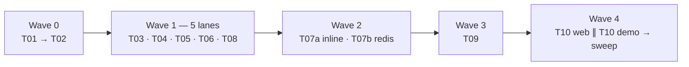

# Adaptive Voice Interviewer — task breakdown

Execution plan for `tasks/adaptive-voice-interviewer-prd.md`. Ten tasks, five
waves. Read the PRD first; these files add *how*, never *what* — where the PRD
and a task disagree, the PRD wins.

> **PoC shape, decided after the PRD's first draft and folded into it.** The
> candidate answers **by voice**; the interviewer replies **in text**
> (`REPLY_MODE=text`, `TTS_PROVIDER=none`). The camera is preview only. Every
> turn is executed by a **worker off a Redis stream** — the API stores the
> upload, returns `202` and polls. TTS is built and tested in T04 and skipped by
> T07's `synthesize` step, so voice-out is a flag, not a task. Touched: T01, T04,
> T07, T08, T09, T10.

> **Scope cut, decided after the PoC shape and folded into the PRD.** The
> **knowledge base, retrieval and the embedder are out** — no corpus, no
> chunking, no ranking, no `KnowledgeRetriever` port. The **persona is the whole
> configuration**: it declares the questions, the topics they cover, the coverage
> rules **and the expected answer for each question**, which is what the new
> **evaluator** scores the transcript against when the session finishes. What
> changed: T06 shrank to the blob store, T02 lost the retrieval port and the
> guide entity, T05 lost the knowledge tables and gained `interview_reports`,
> T07 dropped the `retrieve` step and gained the three-step evaluation workflow,
> T08 gained the evaluator, T09 gained `202`-finish + report reads, T10 renders
> and prints the report. Touched: T01, T02, T05, T06, T07, T08, T09, T10.

> **The session flow, decided last and folded into the PRD (§1).** A candidate
> opens a **public link**, enters a **passkey** (no account, ever), is greeted by
> the persona's authored introduction, **says their name** — which is transcribed
> and registered on the session — then answers the **numbered** questions,
> recording and **re-recording** each take until they send it. When coverage is
> reached the persona's **farewell** closes the interview, the evaluation runs on
> the worker, and the session, its audio and its report are stored **for the
> admin**. The candidate is never shown a score. What that added: `Session.phase`
> as a domain state machine, `InterviewInvite` with a bcrypt-hashed passkey,
> session-scoped candidate tokens beside the admin JWT, `Turn.kind` so intake and
> farewell are never scored, three storage adapters (`local_fs`, `gcs`, `s3`) for
> the recordings, and a second web page for the reviewer. Touched: T01, T02, T05,
> T06, T07, T08, T09, T10.

> **The persistence stack, decided after the flow and folded into the PRD
> (§3.2).** Postgres is reached through **SQLModel** — pydantic-typed table
> classes over SQLAlchemy 2.x async and `asyncpg` — with **Alembic** as the
> migration chain. The rule that comes with it: a SQLModel table is **not** a
> domain object. Tables live in `persistence/tables.py`, never leave the adapter,
> and the repository maps them to the frozen dataclasses of T02 both ways.
> Taking SQLModel's headline shortcut — let the table *be* the model — would put
> a SQLAlchemy import in the pure core and hand the engine lazy attributes that
> raise outside a session. Touched: T01 (`alembic.ini`, dependency split), T02
> (the purity test names `sqlmodel`), T05 (tables, Alembic wiring, the boundary
> test).

> **Private working note.** These files quote paths from this repository as
> *reference material for the implementer*. They stay here. Nothing in this
> folder — no path, no module name, no product detail — is copied into the
> public interviewer repository. The PRD is the only public document, and it
> names nothing from here.

## How to read a reference

Every task has a **Reference in this repo** section. Those files are read for
**shape**: how a registry is keyed, how a port is declared, how a lease is
recovered. Copy the *idea*, retype the code. A verbatim paste is both a leak and
a bad fit — the new project has different domain names and no legacy.

## Numbering — this folder against the PRD

The PRD's §11 table lists **sixteen** fine-grained items (T1…T16); this folder
bundles them into **ten lanes** (T01…T10), because a lane is a worktree and a
worktree is worth opening only for a body of work with its own tests and its own
`CONTEXT.md`. Each file's header says which PRD items it covers — T09, for
instance, covers PRD §11 T12–T13. Where a branch name or a wave number differs
between the two, this folder is the one to follow for *execution*; the PRD stays
the authority on *what* is built.

## Waves and parallelism

Two edits to the PRD's wave table, both explained under **Sequencing** below:
**T08 moves to wave 1** (it needs nothing from wave 1), and **T07 splits** —
`inline` is a blocker, `redis_streams` is not.



| Task | Wave | Runs in parallel with | Depends on |
|---|---|---|---|
| [T01 — build skill, docs system, scaffold](T01-build-skill-and-scaffold.md) | 0 | — (nothing exists yet) | — |
| [T02 — settings, errors, domain, ports, registry contract](T02-core-domain-ports-settings.md) | 0 | — (freezes the ports every lane compiles against) | T01 |
| [T03 — provider registry + LLM adapters](T03-registry-and-llm-adapters.md) | 1 | T04, T05, T06, T08 | T02 |
| [T04 — speech adapters (STT + TTS)](T04-speech-adapters.md) | 1 | T03, T05, T06, T08 | T02 |
| [T05 — persistence (SQLModel + Alembic)](T05-persistence.md) | 1 | T03, T04, T06, T08 | T02 |
| [T06 — blob storage: local, GCS, S3](T06-blob-storage.md) | 1 | T03, T04, T05, T08 | T02 |
| [T08 — interview engine + evaluator](T08-interview-engine.md) | 1 | T03, T04, T05, T06 | T02 (builds on fakes) |
| [T07a — workflow contract + `inline`](T07-durable-workflow.md) | 2 | T07b | T02, T05 |
| [T07b — `redis_streams` adapter](T07-durable-workflow.md) | 2 | T07a (starts once the contract suite is green) | T07a |
| [T09 — API, auth, worker process](T09-api-auth-and-worker.md) | 3 | T07b | T05, T07a, T08 |
| [T10 — web pages, demo script, docs sweep](T10-web-demo-and-docs-sweep.md) | 4 | web ∥ demo inside the task | T09 |

**A wave closes when every lane in it is merged and `make check` is green on
`master`.** Do not open wave *n+1* against a lane of wave *n*.

## Sequencing — what is actually sequential

Only these edges are hard. Everything else is a scheduling choice.

```
T01 → T02 → T05 → T07a → T09 → T10(web|demo) → T10(sweep)
```

| Edge | Why it cannot overlap |
|---|---|
| T01 → T02 | no workspace, no `make check`, no skill to build through |
| T02 → everything | the port layer freezes here; five lanes compile against it |
| T05 → T07a | `workflow_runs` / `workflow_step_records` **are** the checkpoint |
| T07a → T09 | the API hands a run to an engine; the worker consumes one |
| T08 → T09 | the routers need a pipeline to call |
| T09 → T10 | the page builds on the OpenAPI schema; the demo drives real routes |
| T10 web+demo → T10 sweep | diagrams are regenerated against merged code |

That chain is the critical path. Six links. Nothing shortens it, so anything on
it starts the moment its predecessor merges, and anything off it waits.

### Recommendations

1. **T08 belongs in wave 1, not wave 2.** The engine touches `packages/core`
   only and runs entirely on fakes. It depends on T02, never on T07. Left in
   wave 2 it idles a lane through wave 1 and then blocks T09.
2. **Start T05 first inside wave 1.** T07a waits on it; nothing waits on T03,
   T04 or T06.
3. **Split T07 at its seam.** The contract suite plus `inline` (**T07a**) is what
   T09 blocks on — the API and the whole test suite run on `inline`.
   `redis_streams` (**T07b**) blocks nothing: it lands inside wave 2 against the
   same contract suite, and nothing in wave 3 waits for it. It is not optional
   either — T09's last done-when (one turn end to end on
   `WORKFLOW_PROVIDER=redis`) is the criterion T07b makes tickable, so wave 2
   does not close without it. Merging the two halves would make the critical path
   a wave longer for no gain.
4. **T09 has an internal order**: auth → routers → `deps.py` → worker. The worker
   is the tail; the API demos an interview on `inline` before it exists.
5. **Keep wave 0 thin.** It is one agent with the others idle, and it is the only
   part of the plan that cannot be parallelised. A scaffold that compiles and
   ports that are right — nothing more. Everything else parallelises.

### Solo order — one worktree at a time

Cheapest blocker first. The loop runs end to end on fakes at T09; every task
after it replaces a fake with a real adapter, so each one is demoable and none
blocks another.

```
T01 → T02 → T05 → T07a → T08 → T09 → T03 → T04 → T06 → T07b → T10
```

### Four agents

| | Wave 0 | Wave 1 | Wave 2 | Wave 3 | Wave 4 |
|---|---|---|---|---|---|
| **A** | T01 → T02 | T05 | T07a | T09 | sweep |
| **B** | idle | T08 | T07b | — | web |
| **C** | idle | T03 | — | — | demo |
| **D** | idle | T04 → T06 | — | — | — |

## Worktree protocol — open, work, land

Every task runs in its **own git worktree, on its own branch**, and lands on
`master` **directly** when it is green. No pull request, no review queue, no
long-lived integration branch: the trunk is the integration point and a task
that is done is a task that is on it.

The main checkout stays on `master` and is never used for task work. Git refuses
to check out one branch in two worktrees, which is exactly the guard we want.

### 1. Open

```bash
# from the main checkout, always on master
cd <repo>
git switch master
git pull --ff-only            # if there is a remote

git worktree add ../wt-t05-persist -b task/t05-persistence master
cd ../wt-t05-persist
make install                  # each worktree has its own venv
make up                       # postgres + redis via docker compose, shared by every lane
```

Wave 1, five lanes opened at once from the wave-0 tip:

```bash
git worktree add ../wt-t03-llm       -b task/t03-llm-adapters    master
git worktree add ../wt-t04-speech    -b task/t04-speech-adapters master
git worktree add ../wt-t05-persist   -b task/t05-persistence     master
git worktree add ../wt-t06-storage   -b task/t06-blob-storage    master
git worktree add ../wt-t08-engine    -b task/t08-engine          master
```

One `docker compose` stack serves every lane — `make up` once, on the host, and
all five worktrees point at the same Postgres and Redis. Unit tests need
neither, so lanes never contend for them; only `make itest` and the drills do.

### 2. Work

Through the `build` skill (T01), inside the worktree, never anywhere else:

> worktree → read the module's `CONTEXT.md` → port first → fake before adapter →
> tests red then green → adapter registered as data → wire the composition root
> → document → `make check`

Commit as you go, small and conventional. Scope is the task's module:

```bash
git add -A
git commit -m "feat(persistence): repository ports over SQLModel async"
git commit -m "test(persistence): one contract suite over SQL and in-memory"
git commit -m "docs(persistence): CONTEXT.md, unique constraints and why"
```

### 3. Land on `master`

`make check` **inside the worktree** first. It needs no network and no
containers, so there is no excuse to skip it.

```bash
cd ../wt-t05-persist
make check                    # ruff, mypy --strict, tests, coverage, docs-check

cd <repo>                     # the master checkout
git switch master
git merge --no-ff task/t05-persistence -m "feat(persistence): schema, repositories, contract suite (T05)"
make check                    # green on the trunk, not only on the branch

git worktree remove ../wt-t05-persist
git branch -d task/t05-persistence
```

`--no-ff` on purpose: one merge commit per task keeps the task boundary readable
in `git log --first-parent` months later. Use `--squash` instead only when a
lane's history is genuinely noisy.

**If `make check` fails on `master` after the merge**, fix it on `master`, at
once, in a follow-up commit. Never leave the trunk red for the next lane to
inherit — every other worktree branches off it.

### The eight rules

1. Branch `task/t<NN>-<slug>`. One task, one branch, one worktree, one merge.
2. Branch off `master` at the **tip of the previous wave**, never off a sibling
   lane. Needing a sibling's code means the wave plan is wrong — fix the plan,
   do not cross-merge.
3. **A task owns its paths.** The `Owns` block in each file is the contract.
   Files under those paths belong to that branch alone.
4. **Shared files are append-only**: `packages/adapters/src/interviewer_adapters/__init__.py`
   (registration imports), `.env.example`, `apps/*/deps.py`, the README
   configuration table. Append a block at the end, never reorder. A conflict then
   resolves by keeping both sides.
5. **A branch lands green**: `make check` in the worktree, then again on `master`
   after the merge.
6. **Land in wave order**, then remove the worktree and delete the branch. A
   stale worktree is a checkout someone will eventually edit by accident.
7. **The port layer freezes when wave 0 lands.** A lane that needs a port changed
   stops and says so — it does not edit a Protocol every other lane is compiling
   against.
8. **Every lane runs through the `build` skill.** A task is not done until the
   docs it touched moved in the **same** branch. A doc updated in a later commit
   is a doc that was never updated.

## Definition of done, for every task

- `make check` green in the worktree: `ruff`, `mypy --strict`, unit suite,
  coverage ≥ 80%, `docs-check`.
- Unit tests run with **no network, no Postgres, no Redis**.
- The module's `CONTEXT.md` exists and carries all six headings.
- No provider name appears in `packages/core`. No `if/elif` on a provider slug
  anywhere.
- The task is **on `master`**, merged from its worktree, and `make check` is
  green there too.
- The worktree is removed and the branch deleted.

## The expansion — knowledge base + embedder

**Not in this plan, and the first thing to build after it.** Ten tasks above
deliver an interview that is conducted, transcribed and scored; nothing in them
retrieves anything. The persona's questions and expected answers are the only
grounding, which is enough for a complete loop and is the reason the loop
finishes.

The expansion is PRD §11 `E1`, in two steps and in this order:

1. **Knowledge base + lexical retrieval.** A `KnowledgeRetriever` port,
   `knowledge_documents` / `knowledge_chunks` in their own migration,
   deterministic chunking, ingestion at `POST /areas/{id}/documents`, BM25-style
   ranking with the area scope applied **inside** the query, and a `retrieve`
   step inserted between `transcribe` and `compose` that degrades to empty and
   records that it did.
2. **The embedder.** Embeddings and a vector adapter behind that same port,
   selected by `RETRIEVAL_PROVIDER=vector`, with no engine change — which is the
   claim the port exists to make good on.

The persona keeps deciding **what** is asked; the corpus improves **how** a
follow-up lands on an answer nobody anticipated. Both arrive as a port, an
adapter and a workflow step **together** — that is why no retrieval seam is left
half-open in the code now.
